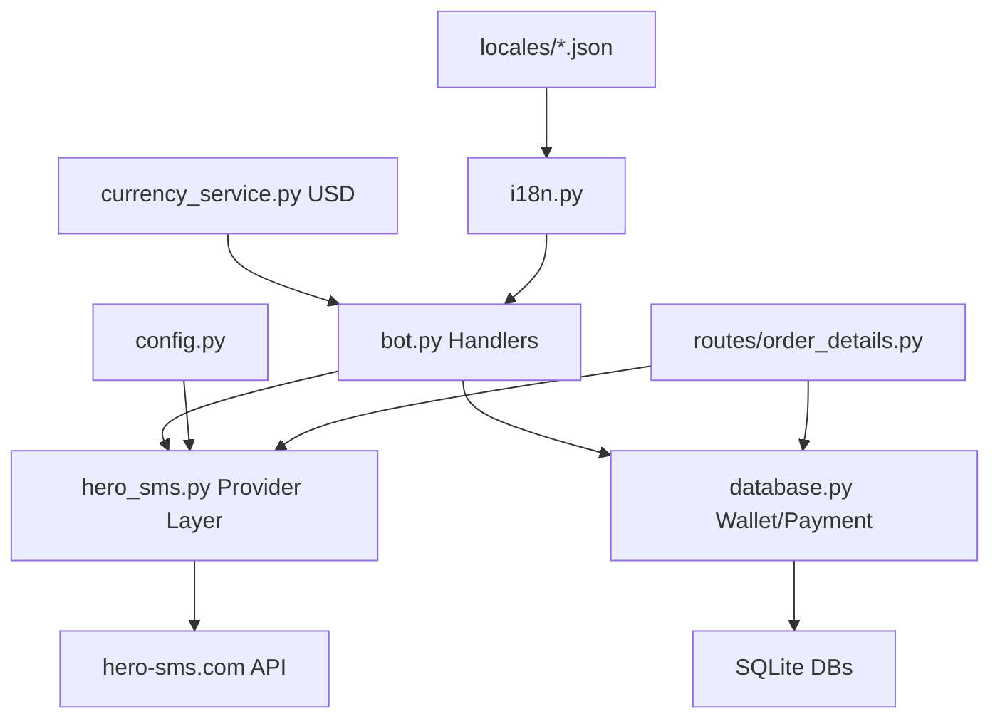

# 🔬 Comprehensive Architectural Analysis & Migration Plan

## Project: 5simTelegramBot → HeroSMS Multi-Language Telegram Bot

---

## 📊 Executive Summary

The current project is a **Telegram bot** for selling virtual phone numbers, built around the **5sim.net** API. The codebase has **partial i18n already implemented** but with significant gaps. The project needs two major transformations:

1. **Complete the i18n system** (30% already done, 70% remaining)
2. **Replace 5sim API with hero-sms.com** (SMS-Activate protocol)

---

## 🏗️ Current Architecture Map

```
┌────────────────────────────────────────────────────────────┐
│                        bot.py (4073 lines)                 │
│  Telegram handlers + Flask routes + 5sim API calls         │
│  ⚠️ MONOLITH - contains duplicated DB functions from       │
│     database.py, hardcoded Persian strings everywhere      │
├────────────────────────────────────────────────────────────┤
│  config.py          │  database.py      │  i18n.py         │
│  FIVESIM_CONFIG ✅  │  language col ✅  │  get_text() ✅   │
│  PAYMENT_CONFIG ✅  │  add_balance ✅   │  set_user_lang ✅│
│  DB_CONFIG ✅       │  transactions ✅  │  locales/*.json ✅│
├────────────────────────────────────────────────────────────┤
│  wallet.py          │  payment.py       │  card_payment.py │
│  Balance mgmt ✅    │  ZarinPal ✅      │  Card2Card ✅    │
├────────────────────────────────────────────────────────────┤
│  currency_service.py│  operator_config  │  backup_manager  │
│  Navasan RUB API ✅ │  Operator DB ✅   │  JSON backup ✅  │
├────────────────────────────────────────────────────────────┤
│  admin_config.py    │  bot_utils.py     │  routes/         │
│  Admin settings ✅  │  Telegram msg ✅  │  order_details.py│
└────────────────────────────────────────────────────────────┘
```

---

## 🔴 PHASE 1: i18n Completion Analysis

### ✅ What's ALREADY Implemented

| Component | Status | File |
|-----------|--------|------|
| `i18n.py` translation service | ✅ Complete | [`i18n.py`](i18n.py) |
| `locales/fa.json` (Persian) | ✅ Complete | [`locales/fa.json`](locales/fa.json) |
| `locales/en.json` (English) | ✅ Complete | [`locales/en.json`](locales/en.json) |
| `locales/ar.json` (Arabic) | ✅ Complete | [`locales/ar.json`](locales/ar.json) |
| `language TEXT DEFAULT 'fa'` column | ✅ Complete | [`database.py:25`](database.py:25) |
| Migration for existing DBs | ✅ Complete | [`database.py:28-31`](database.py:28) |
| `/language` command | ✅ Complete | [`bot.py:353-376`](bot.py:353) |
| `setlang_` callback | ✅ Complete | [`bot.py:378-394`](bot.py:378) |
| Main menu keyboard i18n | ✅ Complete | `inline_main_keyboard()` |
| Services keyboard i18n | ✅ Complete | `services_keyboard()` |
| Start handler i18n | ✅ Complete | `start_handler()` |
| Help section i18n | ✅ Complete | Most handlers |
| Admin panel i18n | ✅ Partial | Admin menu items only |
| Country selection i18n | ✅ Partial | Some strings |

### ❌ Hardcoded Persian Strings (GAPS)

#### 1. [`back_to_main_menu()`](bot.py:553) - CRITICAL
```python
# CURRENT (hardcoded):
bot.edit_message_text(
    "👋 به منوی اصلی بازگشتید.\nلطفاً یکی از گزینه‌های زیر را انتخاب کنید:",
    ...
)
# SHOULD BE:
bot.edit_message_text(
    get_text(call.from_user.id, 'welcome_back'),
    ...
)
```

#### 2. [`handle_service_selection()`](bot.py:562-629) - FULL FUNCTION
```python
# Lines 568, 619, 622, 629 have hardcoded Persian strings
# Need: services.error_fetch, navigation.back_to_services, 
#       countries.select, errors.general_short
```

#### 3. [`handle_buy_number()`](bot.py:2200-2425) - FULL FUNCTION
```python
# Lines 2276-2425: Multiple hardcoded Persian strings
# "⚠️ موجودی شما کافی نیست", "💰 افزایش موجودی", "🔙 برگشت"
# Entire success/error messages are hardcoded
```

#### 4. [`handle_get_code()`](bot.py:2427-2497) - FULL FUNCTION
```python
# Lines 2459-2493: All user-facing strings hardcoded
```

#### 5. [`handle_cancel_order()`](bot.py:2566-2641) - FULL FUNCTION
```python
# Lines 2574-2639: All user-facing strings hardcoded
```

#### 6. [`handle_add_funds()`](bot.py:2911-2925) - MEDIUM
```python
# Lines 2915-2921: Payment method buttons hardcoded
# Actually has get_text equivalents available
```

#### 7. [`process_zarinpal_amount()`](bot.py:2937-2993) - FULL FUNCTION
```python
# Lines 2941-2993: All messages hardcoded
```

#### 8. [`verify_payment()`](bot.py:2995-3094) - FULL FUNCTION
```python
# Lines 3003-3094: All messages hardcoded
```

#### 9. [`handle_card_payment()`](bot.py:3098-3106) - MINOR
```python
# Lines 3101-3102: Amount prompt hardcoded
```

#### 10. [`handle_send_receipt()`](bot.py:3113-3121) - MINOR
#### 11. [`check_card_info()`](bot.py:3128-3154) - FULL FUNCTION
#### 12. [`handle_new_card()`](bot.py:3156-3168) - FULL FUNCTION
#### 13. [`process_card_number()`](bot.py:3170-3210) - FULL FUNCTION
#### 14. [`process_card_holder()`](bot.py:3212-3254) - FULL FUNCTION
#### 15. [`handle_my_orders()`](bot.py:2824-2848) - FULL FUNCTION
#### 16. [`handle_operator_settings()`](bot.py:2678-2719) - FULL FUNCTION
#### 17. [`handle_change_operator()`](bot.py:2721-2747) - FULL FUNCTION
#### 18. [`handle_select_service()`](bot.py:2749-2786) - FULL FUNCTION
#### 19. [`handle_select_country()`](bot.py:2788-2801) - MINOR
#### 20. [`process_operator_change()`](bot.py:2803-2821) - FULL FUNCTION
#### 21. Multiple Flask routes with hardcoded messages
#### 22. Multiple test/debug routes with hardcoded messages

### 🔧 Phase 1-A: New i18n keys needed

Keys that exist in locales but need to be added to handlers, AND keys that don't exist yet but are needed:

| Missing Key | English Value | Used In |
|-------------|---------------|---------|
| `payment_methods.zarinpal` | "💳 Online Payment (ZarinPal)" | add_funds handler |
| `payment_methods.card_to_card` | "💳 Card to Card" | add_funds handler |
| `services.error_fetch` | "❌ Error fetching service info" | handle_service_selection |
| All existing keys need wiring | See JSON files | Various handlers |

---

## 🔵 PHASE 2: 5sim → hero-sms.com Migration Analysis

### 📡 ALL 5sim API Call Locations

| # | Location | Endpoint | Purpose |
|---|----------|----------|---------|
| 1 | [`bot.py:242-248`](bot.py:242) | `GET /v1/guest/products/{product}` | Get base prices |
| 2 | [`bot.py:259-263`](bot.py:259) | `GET /v1/guest/products/{country}/{operator}` | Get products |
| 3 | [`bot.py:824-828`](bot.py:824) | `GET /v1/guest/prices` | Get country prices |
| 4 | [`bot.py:2026-2028`](bot.py:2026) | `GET /v1/user/buy/activation/{country}/any/{service}` | Buy number (old) |
| 5 | [`bot.py:2117`](bot.py:2117) | `GET /v1/user/buy/activation/{country}/{operator}/{product}` | Buy number |
| 6 | [`bot.py:2243-2246`](bot.py:2243) | `GET /v1/guest/prices` | Get price before purchase |
| 7 | [`bot.py:2438`](bot.py:2438) | `GET /v1/user/check/{order_id}` | Check order/code |
| 8 | [`bot.py:2586-2588`](bot.py:2586) | `GET /v1/user/cancel/{order_id}` | Cancel order |
| 9 | [`bot.py:3914-3917`](bot.py:3914) | `GET /v1/guest/prices` | Get Telegram price |
| 10 | [`bot.py:3997`](bot.py:3997) | `GET /v1/guest/countries` | Test API key |
| 11 | [`routes/order_details.py:259-261`](routes/order_details.py:259) | `GET /v1/user/cancel/{activation_id}` | Cancel via web |
| 12 | [`config.py:10-13`](config.py:10) | `FIVESIM_CONFIG` | Config definition |

### 🔄 API Protocol Mapping: 5sim → SMS-Activate (hero-sms.com)

hero-sms.com uses the **SMS-Activate API protocol**. Key differences:

| Aspect | 5sim | SMS-Activate Protocol |
|--------|------|----------------------|
| **Auth** | `Bearer {token}` header | `api_key` query parameter |
| **Base URL** | `https://5sim.net/v1` | `https://hero-sms.com/stubs/handler_api.php` (TBC) |
| **Response** | JSON (`application/json`) | Plain text (`ACCESS_NUMBER:...`) |
| **Price currency** | RUB (Rubles) | USD (Dollars) |
| **Country format** | `cyprus`, `canada` | `12` (numeric country IDs) |
| **Service format** | `telegram`, `whatsapp` | `tg` (short service codes) |
| **Operator** | `virtual4`, `mts` | `any`, `mts` (varies) |

### 📋 Endpoint Mapping

```
Price check:
  5sim:  GET /v1/guest/prices?country=cyprus&product=telegram
  SMS-A: GET ?api_key=XXX&action=getPrices&country=12&service=tg
  
Get numbers status:
  5sim:  GET /v1/guest/products/{country}/{operator}
  SMS-A: GET ?api_key=XXX&action=getNumbersStatus&country=12&operator=any

Buy number:
  5sim:  GET /v1/user/buy/activation/{country}/{operator}/{product}
  SMS-A: GET ?api_key=XXX&action=getNumber&service=tg&country=12&operator=any

Check status (get SMS):
  5sim:  GET /v1/user/check/{order_id}
  SMS-A: GET ?api_key=XXX&action=getStatus&id={activation_id}

Cancel order:
  5sim:  GET /v1/user/cancel/{order_id}
  SMS-A: GET ?api_key=XXX&action=setStatus&id={activation_id}&status=8

Get balance:
  5sim:  GET /v1/user/profile
  SMS-A: GET ?api_key=XXX&action=getBalance
```

### 💰 Currency System Impact (RUB → USD)

The entire pricing system is RUB-based:
- `admin_config.py`: `ruble_rate` setting
- `currency_service.py`: Fetches RUB/IRR from Navasan API
- `bot.py`: Multiple `ruble_rate` references for price calculation
- `admin_config.py`: `set_ruble_rate()` and `get_ruble_rate()`
- `operator_config.py`: Operator codes mapped for 5sim

**SMS-Activate uses USD**. This means:
1. Replace "ruble_rate" → "usd_rate" throughout
2. Update `currency_service.py` to fetch USD/IRR
3. Update admin panel labels to show USD
4. Price calculation: `USD_price * usd_rate * (1 + profit%)` instead of `RUB_price * ruble_rate * (1 + profit%)`
5. Update all locale/admin i18n references from "ruble" to "dollar/USD"

### 📁 Files Impacted by Phase 2

| File | Changes Needed | Risk Level |
|------|---------------|------------|
| [`config.py`](config.py) | Replace `FIVESIM_CONFIG` with `HEROSMS_CONFIG` | 🟢 LOW |
| NEW `hero_sms.py` | Create API abstraction layer | 🟡 MEDIUM |
| [`bot.py`](bot.py) | Replace all 12 API call sites | 🔴 HIGH |
| [`routes/order_details.py`](routes/order_details.py) | Replace cancel API call | 🟡 MEDIUM |
| [`currency_service.py`](currency_service.py) | Switch from RUB to USD | 🟡 MEDIUM |
| [`admin_config.py`](admin_config.py) | Rename ruble_rate → usd_rate | 🟢 LOW |
| [`operator_config.py`](operator_config.py) | Update operator codes if needed | 🟡 MEDIUM |
| [`i18n.py`](i18n.py) | Update docstring references | 🟢 LOW |
| `locales/*.json` | Update ruble→USD references | 🟢 LOW |

### 🛡️ Financial Integrity Checklist

These flows MUST remain intact:
- ✅ Balance deduction on purchase
- ✅ Balance refund on cancel
- ✅ Transaction recording
- ✅ Card-to-card payment approval flow
- ✅ ZarinPal payment verification flow
- ✅ Admin balance modification
- ✅ Backup/restore system

---

## 🗺️ Migration Architecture



### New File: `hero_sms.py` - Provider Abstraction Layer

This file will encapsulate ALL hero-sms.com API communication:
- `get_balance(api_key)` 
- `get_numbers_status(api_key, country, operator)`
- `get_prices(api_key, country, service)`
- `buy_number(api_key, country, operator, service)`
- `get_sms(api_key, activation_id)`
- `cancel_order(api_key, activation_id)`
- `get_countries(api_key)`

---

## 📋 Ordered Execution Plan

### Phase 1: i18n Completion (Lower Risk, Can Deploy Independently)

| Step | File | Action | Priority |
|------|------|--------|----------|
| 1.1 | [`bot.py`](bot.py:553) | Fix `back_to_main_menu()` hardcoded text | P0 |
| 1.2 | [`bot.py`](bot.py:562) | i18n `handle_service_selection()` | P0 |
| 1.3 | [`bot.py`](bot.py:2200) | i18n `handle_buy_number()` | P0 |
| 1.4 | [`bot.py`](bot.py:2427) | i18n `handle_get_code()` | P0 |
| 1.5 | [`bot.py`](bot.py:2566) | i18n `handle_cancel_order()` | P0 |
| 1.6 | [`bot.py`](bot.py:2911) | i18n payment/add_funds handlers | P1 |
| 1.7 | [`bot.py`](bot.py:3096) | i18n card payment handlers | P1 |
| 1.8 | [`bot.py`](bot.py:2824) | i18n `handle_my_orders()` | P1 |
| 1.9 | [`bot.py`](bot.py:2678) | i18n operator settings handlers | P1 |
| 1.10 | `locales/*.json` | Add any missing i18n keys | P1 |
| 1.11 | [`bot.py`](bot.py:105) | Remove duplicate `get_user_balance`/`add_balance` (use database.py) | P1 |

### Phase 2: API Migration (Higher Risk, Requires Testing)

| Step | File | Action | Priority |
|------|------|--------|----------|
| 2.1 | NEW `hero_sms.py` | Create SMS-Activate protocol API layer | P0 |
| 2.2 | [`config.py`](config.py) | Replace `FIVESIM_CONFIG` with `HEROSMS_CONFIG` | P0 |
| 2.3 | [`currency_service.py`](currency_service.py) | Switch from RUB to USD fetch | P0 |
| 2.4 | [`admin_config.py`](admin_config.py) | Rename ruble_rate → usd_rate, update labels | P0 |
| 2.5 | [`bot.py`](bot.py) | Replace all 5sim API calls with hero_sms.py calls | P0 |
| 2.6 | [`routes/order_details.py`](routes/order_details.py) | Replace cancel API call | P0 |
| 2.7 | [`operator_config.py`](operator_config.py) | Update operator codes for SMS-Activate protocol | P1 |
| 2.8 | `locales/*.json` | Update ruble→USD text references | P1 |
| 2.9 | [`i18n.py`](i18n.py:2) | Update docstring references | P1 |
| 2.10 | [`requirements.txt`](requirements.txt) | Add any new dependencies if needed | P1 |

---

## ⚠️ Risk Assessment Matrix

| Risk | Probability | Impact | Mitigation |
|------|------------|--------|------------|
| Breaking financial transactions | Medium | 🔴 CRITICAL | Isolate all wallet/payment code from API changes |
| SMS-Activate response format mismatch | Medium | 🟡 HIGH | Create comprehensive response parser with error handling |
| Country/service code incompatibility | High | 🟡 HIGH | Create mapping table, verify with hero-sms docs |
| Operator naming differences | High | 🟡 MEDIUM | Allow admin to configure operators per service/country |
| Price calculation errors (USD vs RUB) | Low | 🔴 CRITICAL | Thorough testing with mock responses |
| Breaking inline keyboard layouts | Low | 🟢 LOW | Keyboards are text-only, i18n preserves structure |
| Database schema conflict | Low | 🟡 MEDIUM | `language` column already has migration path |

---

## 🔑 Key Design Decisions Required From You

Before I proceed with implementation, please confirm:

1. **hero-sms.com API base URL**: Is it `https://hero-sms.com/stubs/handler_api.php` or different?
2. **hero-sms.com API key**: Do you have a valid API key for hero-sms.com?
3. **Country/Service code mapping**: Does hero-sms.com use numeric country IDs like SMS-Activate, or string codes like 5sim?
4. **Price currency**: Does hero-sms.com use USD? (This affects the currency conversion)
5. **Operator naming**: What operator codes does hero-sms.com use? (e.g., `any`, `mts`, `beeline`, or virtual codes?)
6. **Execution order preference**: Should I complete Phase 1 (i18n) first before Phase 2 (API migration), or interleave them?
