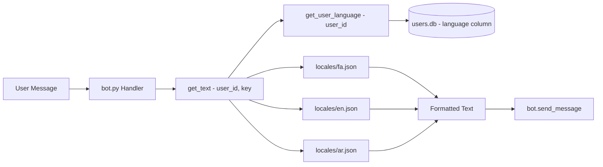

# 📊 تقرير التحليل الشامل لمشروع 5simTelegramBot

> **تاريخ التحليل:** 2026-05-25  
> **المحلل:** Senior Python Architect  
> **حالة المشروع:** قيد التطوير — i18n مكتمل جزئياً (~60%)  
> **نوع التحليل:** فحص كامل بدون تعديل أي ملف

---

## 📁 1. هيكل المشروع الكامل

```
5simTelegramBot-main/
├── 📄 bot.py                    (3971 سطر)  ⚠️ MONOLITH — القلب النابض للمشروع
├── 📄 config.py                 (31 سطر)    🔑 مفاتيح API + إعدادات البوت + الدفع
├── 📄 database.py               (224 سطر)   🗄️ إدارة قواعد البيانات (3 قواعد)
├── 📄 i18n.py                   (174 سطر)   🌐 نظام الترجمة (fa/en/ar)
├── 📄 payment.py                (109 سطر)   💳 بوابة زرينبال (ZarinPal)
├── 📄 card_payment.py           (275 سطر)   💳 الدفع بالبطاقة (كارت به كارت)
├── 📄 wallet.py                 (211 سطر)   💰 إدارة المحفظة والرصيد
├── 📄 admin_config.py           (243 سطر)   👨‍💼 إعدادات المدير + القنوات الإجبارية
├── 📄 operator_config.py        (113 سطر)   📡 إعدادات المشغلين (operators)
├── 📄 currency_service.py       (58 سطر)    💱 أسعار العملات (روبل → تومان)
├── 📄 backup_manager.py         (115 سطر)   💾 النسخ الاحتياطي التلقائي
├── 📄 bot_utils.py              (128 سطر)   🛠️ إرسال رسائل تلجرام مساعدة
├── 📄 routes/
│   └── order_details.py         (333 سطر)   🌐 مسارات Flask للويب
├── 📄 templates/
│   ├── database_viewer.html
│   ├── number_details.html
│   ├── order_status.html
│   └── user_orders.html
├── 📂 locales/
│   ├── fa.json                  (358 سطر)   🇮🇷 فارسی — اللغة الافتراضية
│   ├── en.json                  (358 سطر)   🇬🇧 English
│   └── ar.json                  (358 سطر)   🇸🇦 العربية
├── 📂 data/
│   └── users_backup.json                    💾 نسخة احتياطية (مستخدمان)
├── 📂 plans/
│   ├── analysis_and_migration_plan.md       📋 خطة التحليل السابقة
│   └── phase1_i18n_execution_plan.md        📋 خطة i18n التفصيلية
├── 📄 requirements.txt                     📦 التبعيات
├── 📄 install.sh                           🔧 سكريبت التثبيت (Linux)
├── 📄 start_bot.bat                        🔧 سكريبت التشغيل (Windows)
├── 📄 README.md
└── 📄 LICENSE
```

---

## 📊 2. إحصائيات المشروع

| المقياس | القيمة |
|----------|--------|
| عدد ملفات Python | **16** |
| إجمالي أسطر الكود | **~6,500** سطر |
| حجم bot.py | **3,971** سطر (61% من الكود) |
| قواعد بيانات SQLite | **3** (users.db, admin.db, bot.db) |
| جداول SQLite | **12** جدول |
| استدعاءات get_text() | **214** |
| نصوص فارسية صلبة متبقية | **~188** موقع |
| لغات مدعومة | **3** (fa, en, ar) |
| خدمات مدعومة | **4** (Telegram, WhatsApp, Instagram, Google) |
| دول مدعومة | **20** دولة |
| واجهات API لـ 5sim | **12** نقطة اتصال |
| بوابات دفع | **2** (ZarinPal + Card-to-Card) |

---

## 📋 3. الملفات المهمة (حسب الفئة)

### 3.1 🔴 الملفات الأساسية (لا يجب كسرها أبداً)

| الملف | السبب | مستوى الخطورة |
|--------|-------|---------------|
| [`config.py`](5simTelegramBot-main/config.py:1) | يحتوي مفاتيح API حساسة + توكن البوت + مفاتيح الدفع | 🔴 حرج |
| [`database.py`](5simTelegramBot-main/database.py:1) | يدير 3 قواعد بيانات + المخطط (schema) + ترحيل البيانات | 🔴 حرج |
| [`bot.py`](5simTelegramBot-main/bot.py:3914) (دالة main) | نقطة بدء التشغيل + webhook setup + استعادة النسخ الاحتياطي | 🔴 حرج |

### 3.2 🟡 ملفات 5sim المرتبطة

| الملف | عدد نقاط الاتصال | التفاصيل |
|--------|-------------------|----------|
| [`bot.py`](5simTelegramBot-main/bot.py:183) | **10** نقاط | guest/products, guest/prices, user/buy/activation, user/check, user/cancel |
| [`routes/order_details.py`](5simTelegramBot-main/routes/order_details.py:259) | **2** نقطتان | user/cancel (من الويب) |
| [`config.py`](5simTelegramBot-main/config.py:10) | **1** (تعريف) | FIVESIM_CONFIG: api_key + api_url |

**قائمة نقاط اتصال 5sim API الكاملة:**

| # | الموقع | الـ Endpoint | الغرض |
|---|--------|-------------|-------|
| 1 | [`bot.py:183-199`](5simTelegramBot-main/bot.py:183) | `GET /v1/guest/products/{product}` | أسعار المنتجات الأساسية |
| 2 | [`bot.py:202-218`](5simTelegramBot-main/bot.py:202) | `GET /v1/guest/products/{country}/{operator}` | المنتجات المتاحة |
| 3 | [`bot.py:740-753`](5simTelegramBot-main/bot.py:740) | `GET /v1/guest/prices` | أسعار الدول (handle_country_selection) |
| 4 | [`bot.py:1946-1954`](5simTelegramBot-main/bot.py:1946) | `GET /v1/user/buy/activation/{country}/any/{service}` | شراء رقم (قديم) |
| 5 | [`bot.py:2036-2071`](5simTelegramBot-main/bot.py:2036) | `GET /v1/user/buy/activation/{country}/{operator}/{product}` | شراء رقم (جديد) |
| 6 | [`bot.py:2148-2161`](5simTelegramBot-main/bot.py:2148) | `GET /v1/guest/prices` | سعر قبل الشراء (handle_buy_number) |
| 7 | [`bot.py:2331-2343`](5simTelegramBot-main/bot.py:2331) | `GET /v1/user/check/{order_id}` | فحص الطلب/الكود |
| 8 | [`bot.py:2480-2490`](5simTelegramBot-main/bot.py:2480) | `GET /v1/user/cancel/{order_id}` | إلغاء الطلب |
| 9 | [`bot.py:3800-3816`](5simTelegramBot-main/bot.py:3800) | `GET /v1/guest/prices` | سعر تيليجرام (صفحة ويب) |
| 10 | [`bot.py:3887-3908`](5simTelegramBot-main/bot.py:3887) | `GET /v1/guest/countries` | اختبار مفتاح API |
| 11 | [`routes/order_details.py:259`](5simTelegramBot-main/routes/order_details.py:259) | `GET /v1/user/cancel/{activation_id}` | إلغاء من الويب |
| 12 | [`config.py:10-13`](5simTelegramBot-main/config.py:10) | تعريف FIVESIM_CONFIG | api_key: JWT token, api_url: 5sim.net/v1 |

### 3.3 🟢 ملفات النصوص الثابتة (Hardcoded Strings)

| الملف | عدد النصوص الصلبة | الحالة |
|--------|-------------------|--------|
| [`bot.py`](5simTelegramBot-main/bot.py:2996) | **~155** نصوص فارسية صلبة | يحتاج i18n |
| [`card_payment.py`](5simTelegramBot-main/card_payment.py:1) | **0** — مكتمل i18n ✅ | ممتاز |
| [`routes/order_details.py`](5simTelegramBot-main/routes/order_details.py:44) | **~10** نصوص في templates | يحتاج i18n |
| [`wallet.py`](5simTelegramBot-main/wallet.py:87) | **3** نصوص (deposit/purchase وصف) | طفيف |
| [`payment.py`](5simTelegramBot-main/payment.py:20) | **1** (وصف افتراضي) | طفيف |

### 3.4 🌐 الملفات التي تحتاج i18n

**الملفات المكتملة بالفعل:**
- [`i18n.py`](5simTelegramBot-main/i18n.py:1) — نظام ترجمة كامل ✅
- [`card_payment.py`](5simTelegramBot-main/card_payment.py:1) — كامل ✅
- [`locales/fa.json`](5simTelegramBot-main/locales/fa.json:1) — 358 مفتاح ✅
- [`locales/en.json`](5simTelegramBot-main/locales/en.json:1) — 358 مفتاح ✅
- [`locales/ar.json`](5simTelegramBot-main/locales/ar.json:1) — 358 مفتاح ✅

**الملفات التي تحتاج i18n (أولويات):**

| الأولوية | الملف | الدوال المستهدفة | عدد النصوص |
|----------|--------|------------------|------------|
| 🔴 P0 | [`bot.py:553`](5simTelegramBot-main/bot.py:553) | `back_to_main_menu()` | 1 |
| 🔴 P0 | [`bot.py:562`](5simTelegramBot-main/bot.py:562) | `handle_service_selection()` | 4 |
| 🔴 P0 | [`bot.py:2200`](5simTelegramBot-main/bot.py:2200) | `handle_buy_number()` (الكامل) | ~25 |
| 🔴 P0 | [`bot.py:2427`](5simTelegramBot-main/bot.py:2427) | `handle_get_code()` | ~6 |
| 🔴 P0 | [`bot.py:2566`](5simTelegramBot-main/bot.py:2566) | `handle_cancel_order()` | ~8 |
| 🟡 P1 | [`bot.py:2911`](5simTelegramBot-main/bot.py:2911) | `handle_add_funds()` + مسارات الدفع | ~10 |
| 🟡 P1 | [`bot.py:2824`](5simTelegramBot-main/bot.py:2824) | `handle_my_orders()` | ~4 |
| 🟡 P1 | [`bot.py:2678`](5simTelegramBot-main/bot.py:2678) | إعدادات المشغلين | ~12 |
| 🟡 P1 | [`bot.py:2996`](5simTelegramBot-main/bot.py:2996) | مدفوعات البطاقة + بطاقة جديدة | ~20 |
| 🟢 P2 | [`bot.py:2995`](5simTelegramBot-main/bot.py:2995) | `verify_payment()` (Flask route) | ~5 |
| 🟢 P2 | [`routes/order_details.py:25`](5simTelegramBot-main/routes/order_details.py:25) | قوالب HTML الويب | ~8 |

### 3.5 💳 الملفات المرتبطة بالمدفوعات

| الملف | نوع الدفع | الحالة |
|--------|-----------|--------|
| [`payment.py`](5simTelegramBot-main/payment.py:1) | ZarinPal (كلاس) | يعمل ✅ |
| [`bot.py:2825-2892`](5simTelegramBot-main/bot.py:2825) | ZarinPal (inline in bot.py) | يعمل ✅ — مكرر مع payment.py |
| [`bot.py:2893-2992`](5simTelegramBot-main/bot.py:2893) | ZarinPal verify route | يعمل ✅ |
| [`card_payment.py`](5simTelegramBot-main/card_payment.py:1) | Card-to-Card + إيصالات | يعمل ✅ |
| [`payment.py:20`](5simTelegramBot-main/payment.py:20) | ZarinPal create_payment | ⚠️ يستخدم payment.py class (غير مستخدم فعلياً) |

**ملاحظة مهمة:** هناك ازدواجية في كود ZarinPal:
- [`payment.py`](5simTelegramBot-main/payment.py:1) يحتوي كلاس `ZarinPal` مع `create_payment()` و `verify_payment()`
- [`bot.py`](5simTelegramBot-main/bot.py:2825) يعيد كتابة نفس المنطق في `process_zarinpal_amount()` و `/verify/<user_id>/<amount>`
- البوت يستخدم النسخة المضمنة في bot.py وليس الكلاس من payment.py

### 3.6 🔐 الملفات الحساسة (لا يجب كسرها)

| الملف | المحتوى الحساس | الإجراء المطلوب |
|--------|---------------|-----------------|
| [`config.py`](5simTelegramBot-main/config.py:3) | **توكن البوت** `7728660088:AAHW7...` | 🚨 يجب نقله إلى .env فوراً |
| [`config.py`](5simTelegramBot-main/config.py:11) | **مفتاح 5sim API** (JWT token كامل) | 🚨 يجب نقله إلى .env فوراً |
| [`config.py`](5simTelegramBot-main/config.py:4) | **آيدي الأدمن** `[1457637832]` | ⚠️ أقل حساسية |
| [`config.py`](5simTelegramBot-main/config.py:28) | **مرچنت كد زرينبال** | 🚨 يجب نقله إلى .env |
| [`config.py`](5simTelegramBot-main/config.py:17) | **مفتاح Navasan API** | ⚠️ مفتاح مجاني |
| [`data/users_backup.json`](5simTelegramBot-main/data/users_backup.json:1) | **أرصدة المستخدمين** | 🔒 بيانات مالية حساسة |

---

## 🔴 4. المشاكل الهندسية الحالية

### 4.1 🔴 مشاكل حرجة (Critical)

#### 4.1.1 ازدواجية تعريف جداول orders (3 تعريفات مختلفة!)

| الموقع | اسم الجدول | الأعمدة |
|--------|-----------|---------|
| [`bot.py:57-78`](5simTelegramBot-main/bot.py:57) | orders (في users.db) | id, user_id, phone_number, service, country, price, order_id, status, order_date |
| [`bot.py:584-598`](5simTelegramBot-main/bot.py:584) | orders (في bot.db) | id, phone_number, service, country, operator, price, status, date, user_id |
| [`bot.py:3618-3650`](5simTelegramBot-main/bot.py:3618) | orders (في bot.db) | id, user_id, activation_id, service, country, operator, phone, price, status, created_at |
| [`database.py:90-108`](5simTelegramBot-main/database.py:90) | orders (في users.db) | id, user_id, service, country, phone_number, price, status, order_id, created_at |

⚠️ **هذا أخطر خطأ في المشروع:** 4 تعريفات مختلفة لنفس الجدول، بعضها في bot.db وبعضها في users.db. هذا يسبب تناقض في البيانات.

#### 4.1.2 تكرار دوال إدارة الرصيد

| الدالة | الموقع في bot.py | الموقع في database.py |
|--------|-----------------|----------------------|
| `get_user_balance()` | محذوفة (كانت موجودة) | [`database.py:114`](5simTelegramBot-main/database.py:114) ✅ |
| `add_balance()` | محذوفة (كانت موجودة) | [`database.py:129`](5simTelegramBot-main/database.py:129) ✅ |
| `save_transaction()` | غير موجودة | [`database.py:156`](5simTelegramBot-main/database.py:156) ✅ |

الحالة: تم استيراد [`get_user_balance`](5simTelegramBot-main/database.py:114) و [`add_balance`](5simTelegramBot-main/database.py:129) من database.py في [`bot.py:14`](5simTelegramBot-main/bot.py:14)، لكن التكرار أُزيل جزئياً.

#### 4.1.3 تكرار إعدادات `settings` عبر قواعد بيانات متعددة

| الموقع | قاعدة البيانات | المفاتيح |
|--------|---------------|---------|
| [`bot.py:558-618`](5simTelegramBot-main/bot.py:558) | bot.db | ruble_rate, profit_percentage |
| [`admin_config.py:43-48`](5simTelegramBot-main/admin_config.py:43) | admin.db | profit_percentage, ruble_rate, channel_lock |
| [`database.py:78-82`](5simTelegramBot-main/database.py:78) | admin.db | settings (جدول عام) |

⚠️ ruble_rate و profit_percentage مخزنة في **قاعدتي بيانات مختلفتين** (bot.db و admin.db). الكود يقرأ من admin.db أحياناً و bot.db أحياناً أخرى.

#### 4.1.4 مرجع غير موجود `BOT_CONFIG['webhook_base_url']`

في [`bot.py:2003`](5simTelegramBot-main/bot.py:2003):
```python
keyboard.add(types.InlineKeyboardButton("📱 مشاهده جزئیات", 
    url=f"{BOT_CONFIG['webhook_base_url']}/number/{order['id']}"))
```
المفتاح `webhook_base_url` غير معرف في [`config.py`](5simTelegramBot-main/config.py:1). المعرف هو `webhook_url`.

### 4.2 🟡 مشاكل متوسطة (Medium)

#### 4.2.1 توكن البوت ومفاتيح API مكشوفة في الكود

- توكن تيليجرام بوت مكشوف في [`config.py:3`](5simTelegramBot-main/config.py:3)
- مفتاح 5sim API مكشوف في [`config.py:11`](5simTelegramBot-main/config.py:11)
- مفتاح Navasan API مكشوف في [`config.py:17`](5simTelegramBot-main/config.py:17)
- مرچنت كد زرينبال مكشوف في [`config.py:28`](5simTelegramBot-main/config.py:28)

#### 4.2.2 `operator_config.py` يحتوي أسماء دول فارسية صلبة

[`operator_config.py:31-57`](5simTelegramBot-main/operator_config.py:31):
```python
('telegram', 'cyprus', 'virtual4', 'قبرس 🇨🇾'),
```
القيمة `country_name` مخزنة بالفارسية في قاعدة البيانات بينما يجب أن تستخدم i18n.

#### 4.2.3 `currency_service.py` يستخدم سعر USD ثابت

[`currency_service.py:49-58`](5simTelegramBot-main/currency_service.py:49):
```python
def _get_usd_to_irr_rate(self):
    return 52000  # نرخ فرضی دلار
```
سعر الدولار ثابت عند 52,000 تومان ولا يتم تحديثه من API حقيقي.

#### 4.2.4 `wallet.py` يحاول استخدام جدول `wallet` غير موجود

[`wallet.py:54`](5simTelegramBot-main/wallet.py:54):
```python
c.execute('SELECT 1 FROM wallet WHERE user_id = ?', (user_id,))
```
جدول `wallet` لم يتم إنشاؤه أبداً — دالة `create_wallet()` فقط تحاول القراءة منه.

#### 4.2.5 تبعيات غير موجودة في `requirements.txt`

| المكتبة | الاستخدام | موجودة؟ |
|---------|-----------|---------|
| `pyTelegramBotAPI` | أساس البوت | ✅ |
| `Flask` | خادم الويب | ✅ |
| `requests` | HTTP client | ✅ |
| `python-dotenv` | متغيرات البيئة | ✅ |
| `persiantools` | تاريخ جلالي | ❌ **مفقودة!** |

`persiantools` مستوردة في [`bot.py:19`](5simTelegramBot-main/bot.py:19) لكنها غير موجودة في requirements.txt.

#### 4.2.6 ملف `.env` غير موجود

[`bot_utils.py:10`](5simTelegramBot-main/bot_utils.py:10) يستدعي `load_dotenv()` لكن ملف `.env` غير موجود في المشروع.

### 4.3 🟢 مشاكل طفيفة (Minor)

#### 4.3.1 كود ميت وغير مستخدم

- [`bot.py:873-881`](5simTelegramBot-main/bot.py:873) — `handle_all_messages()` دالة فارغة
- [`bot.py:305`](5simTelegramBot-main/bot.py:305) — `get_user_language.__module__` تعبير معطل
- [`payment.py`](5simTelegramBot-main/payment.py:1) — كلاس `ZarinPal` غير مستخدم فعلياً
- [`wallet.py`](5simTelegramBot-main/wallet.py:1) — كلاس `Wallet` غير مستخدم (يتم استخدام database.py مباشرة)

#### 4.3.2 ثغرات أمنية

- `bot.py` يستخدم `debug=False` ✅
- لكن:
  - مسارات `/test_*` مكشوفة للإنترنت بدون حماية
  - `/recreate_transactions_table` يدمر البيانات بدون مصادقة
  - `/check_database` يكشف إحصائيات المستخدمين

#### 4.3.3 أخطاء إملائية

- `'indonesia'` مكتوبة خطأ في [`operator_config.py:55`](5simTelegramBot-main/operator_config.py:55) و [`bot.py:527`](5simTelegramBot-main/bot.py:527) — الصحيح `indonesia`
- مفاتيح الدول تستخدم `indonesia` وهذا خطأ إملائي متسق عبر المشروع

---

## 🔄 5. نظام i18n — تحليل الحالة

### 5.1 النظام الحالي



### 5.2 الهيكل الكامل لمفاتيح i18n

```
├── _meta
├── welcome, welcome_back, welcome_approved
├── main_menu.*
├── services.*
├── countries.* (20 دولة)
├── help.* (6 أسئلة + 6 إجابات)
├── wallet.*
├── payment.* (25 مفتاح)
├── language.*
├── channels.* (20 مفتاح)
├── admin.* (40 مفتاح)
├── operators.* (12 مفتاح)
├── purchase.* (15 مفتاح)
├── order.* (15 مفتاح)
├── transactions.* (8 مفاتيح)
├── navigation.* (15 مفتاح)
├── errors.* (12 مفتاح)
├── user_menu.*
└── common.*
```

### 5.3 نسبة اكتمال i18n

| الملف | get_text() calls | Hardcoded strings | نسبة الاكتمال |
|--------|-----------------|-------------------|--------------|
| [`bot.py`](5simTelegramBot-main/bot.py:1) | ~170 | ~155 | **52%** |
| [`card_payment.py`](5simTelegramBot-main/card_payment.py:1) | ~38 | 0 | **100%** ✅ |
| [`i18n.py`](5simTelegramBot-main/i18n.py:1) | 2 (definition) | 0 | **100%** ✅ |
| [`routes/order_details.py`](5simTelegramBot-main/routes/order_details.py:1) | 0 | ~10 | **0%** ❌ |
| **الإجمالي** | **214** | **~168** | **~56%** |

---

## 📊 6. نظام قاعدة البيانات — تحليل كامل

### 6.1 قواعد البيانات الثلاث

| القاعدة | الجداول | الاستخدام |
|---------|---------|-----------|
| **users.db** | users, transactions, card_payments, orders | المستخدمين + الأرصدة + الطلبات + المدفوعات |
| **admin.db** | card_info, settings, required_channels, operator_settings, transactions | إدارة + إعدادات + قنوات + مشغلين |
| **bot.db** | settings, orders, activation_codes | إعدادات الأسعار + طلبات + أكواد التفعيل |

### 6.2 مخطط users.db (الأساسي)

```sql
-- users.db
CREATE TABLE users (
    user_id INTEGER PRIMARY KEY,
    username TEXT,
    first_name TEXT,
    last_name TEXT,
    join_date DATETIME DEFAULT CURRENT_TIMESTAMP,
    balance INTEGER DEFAULT 0,
    is_blocked INTEGER DEFAULT 0,
    language TEXT DEFAULT 'fa'
);

CREATE TABLE transactions (
    id INTEGER PRIMARY KEY AUTOINCREMENT,
    user_id INTEGER,
    amount INTEGER,
    type TEXT,           -- 'deposit' or 'purchase'
    description TEXT,
    ref_id TEXT,
    timestamp DATETIME DEFAULT CURRENT_TIMESTAMP,
    FOREIGN KEY (user_id) REFERENCES users(user_id)
);

CREATE TABLE card_payments (
    payment_id TEXT PRIMARY KEY,
    user_id INTEGER,
    amount INTEGER,
    status TEXT DEFAULT 'pending',
    receipt TEXT,        -- Telegram file_id
    admin_response TEXT,
    created_at DATETIME DEFAULT CURRENT_TIMESTAMP,
    FOREIGN KEY (user_id) REFERENCES users(user_id)
);

CREATE TABLE orders (
    id INTEGER PRIMARY KEY AUTOINCREMENT,
    user_id INTEGER,
    service TEXT,
    country TEXT,
    phone_number TEXT,
    price INTEGER,
    status TEXT,
    order_id TEXT UNIQUE,
    created_at DATETIME DEFAULT CURRENT_TIMESTAMP,
    FOREIGN KEY (user_id) REFERENCES users(user_id)
);
```

### 6.3 مخطط admin.db (الإدارة)

```sql
-- admin.db
CREATE TABLE settings (
    key TEXT PRIMARY KEY,    -- 'profit_percentage', 'ruble_rate', 'channel_lock'
    value TEXT,
    updated_at DATETIME DEFAULT CURRENT_TIMESTAMP
);

CREATE TABLE card_info (
    id INTEGER PRIMARY KEY AUTOINCREMENT,
    card_number TEXT,
    card_holder TEXT,
    updated_at DATETIME DEFAULT CURRENT_TIMESTAMP
);

CREATE TABLE required_channels (
    username TEXT PRIMARY KEY,
    display_name TEXT NOT NULL,
    invite_link TEXT NOT NULL,
    added_date DATETIME DEFAULT CURRENT_TIMESTAMP
);

CREATE TABLE operator_settings (
    id INTEGER PRIMARY KEY AUTOINCREMENT,
    service TEXT NOT NULL,
    country TEXT NOT NULL,
    operator TEXT NOT NULL,
    country_name TEXT NOT NULL,
    UNIQUE(service, country)
);
```

### 6.4 مخطط bot.db (الطلبات والإعدادات)

```sql
-- bot.db
CREATE TABLE settings (
    key TEXT PRIMARY KEY,    -- 'ruble_rate', 'profit_percentage'
    value TEXT NOT NULL
);

CREATE TABLE orders (
    id INTEGER PRIMARY KEY AUTOINCREMENT,
    user_id INTEGER NOT NULL,
    activation_id INTEGER NOT NULL,
    service TEXT NOT NULL,
    country TEXT NOT NULL,
    operator TEXT NOT NULL,
    phone TEXT NOT NULL,
    price INTEGER NOT NULL,
    status TEXT NOT NULL,
    created_at TIMESTAMP DEFAULT CURRENT_TIMESTAMP
);

CREATE TABLE activation_codes (
    id INTEGER PRIMARY KEY AUTOINCREMENT,
    order_id INTEGER NOT NULL,
    code TEXT NOT NULL,
    status TEXT,
    created_at TIMESTAMP DEFAULT CURRENT_TIMESTAMP,
    FOREIGN KEY (order_id) REFERENCES orders(id)
);
```

---

## 📈 7. نظام الرصيد والمحفظة — تحليل كامل

### 7.1 تدفق الرصيد

```mermaid
flowchart TD
    A[إيداع] --> B[add_balance - user_id, +amount]
    B --> C[(users.db - users.balance)]
    B --> D[(users.db - transactions)]
    
    E[شراء رقم] --> F{رصيد كافي؟}
    F -->|نعم| G[add_balance - user_id, -amount]
    F -->|لا| H[رسالة رصيد غير كافي]
    G --> C
    G --> I[(bot.db - orders)]
    
    J[إلغاء طلب] --> K[Cancel via 5sim API]
    K --> L[refund_order_amount]
    L --> M[add_balance + refund]
    M --> C
    
    N[بطاقة إلى بطاقة] --> O[CardPayment.verify_payment]
    O --> P[add_balance + amount]
    P --> C
    P --> Q[(card_payments status=approved)]
    
    R[ZarinPal] --> S[/verify route]
    S --> T[add_balance + amount]
    T --> C
    T --> U[(transactions)]
```

### 7.2 إحصائيات النسخ الاحتياطي

- ملف النسخ الاحتياطي: [`data/users_backup.json`](5simTelegramBot-main/data/users_backup.json:1)
- المستخدمون: 2
- فترة النسخ الاحتياطي: كل 5 ثوانٍ
- المحتوى الحالي: `{"221898889": 2539565, "1457637832": 200000}`

---

## 🛡️ 8. الملفات التي لا يجب المساس بها أثناء التعديل

| # | الملف/الدالة | السبب |
|---|-------------|-------|
| 1 | [`database.py:11-64`](5simTelegramBot-main/database.py:11) — `setup_database()` | يتحكم في إنشاء جميع الجداول والمخطط |
| 2 | [`database.py:114-154`](5simTelegramBot-main/database.py:114) — `get_user_balance()` + `add_balance()` | عمليات مالية حرجة |
| 3 | [`card_payment.py:154-234`](5simTelegramBot-main/card_payment.py:154) — `verify_payment()` | سير موافقة/رفض المدفوعات |
| 4 | [`backup_manager.py:42-58`](5simTelegramBot-main/backup_manager.py:42) — `create_backup()` | الحفاظ على سلامة الأرصدة |
| 5 | [`bot.py:2036-2123`](5simTelegramBot-main/bot.py:2036) — `buy_activation_number()` | API call الأساسي للشراء |
| 6 | [`bot.py:2398-2463`](5simTelegramBot-main/bot.py:2398) — `refund_order_amount()` | استرداد المبالغ عند الإلغاء |
| 7 | [`bot.py:3618-3680`](5simTelegramBot-main/bot.py:3618) — `save_order()` | حفظ الطلبات في قاعدة البيانات |
| 8 | [`i18n.py:96-148`](5simTelegramBot-main/i18n.py:96) — `get_text()` | لب نظام الترجمة |

---

## 🗺️ 9. خطة التعديل الصحيحة خطوة بخطوة

### المرحلة 0: التحضير (آمن تماماً — لا يؤثر على التشغيل)

| الخطوة | الملف | الإجراء | المخاطرة |
|--------|--------|---------|----------|
| 0.1 | `config.py` | نقل المفاتيح الحساسة إلى `.env` | 🟢 لا يوجد |
| 0.2 | `requirements.txt` | إضافة `persiantools` | 🟢 لا يوجد |
| 0.3 | — | أخذ نسخة احتياطية كاملة من المشروع | 🟢 لا يوجد |

### المرحلة 1: i18n — إكمال الترجمة (آمن — يمكن نشره بشكل مستقل)

| الخطوة | الملف | الإجراء | عدد التغييرات |
|--------|--------|---------|--------------|
| 1.1 | [`bot.py:500-507`](5simTelegramBot-main/bot.py:500) | إصلاح `back_to_main_menu()` — النص الصلب الوحيد في هذه الدالة (موجود بالفعل كمفتاح `welcome_back`) | 1 |
| 1.2 | [`bot.py:509-554`](5simTelegramBot-main/bot.py:509) | i18n كامل لـ `handle_service_selection()` | 4 |
| 1.3 | [`bot.py:2125-2322`](5simTelegramBot-main/bot.py:2125) | i18n كامل لـ `handle_buy_number()` وكل رسائلها | 25 |
| 1.4 | [`bot.py:2324-2396`](5simTelegramBot-main/bot.py:2324) | i18n كامل لـ `handle_get_code()` | 6 |
| 1.5 | [`bot.py:2465-2531`](5simTelegramBot-main/bot.py:2465) | i18n كامل لـ `handle_cancel_order()` | 8 |
| 1.6 | [`bot.py:2808-2823`](5simTelegramBot-main/bot.py:2808) | i18n لـ `handle_add_funds()` | 5 |
| 1.7 | [`bot.py:2825-2892`](5simTelegramBot-main/bot.py:2825) | i18n لـ `process_zarinpal_amount()` | 10 |
| 1.8 | [`bot.py:2721-2746`](5simTelegramBot-main/bot.py:2721) | i18n لـ `handle_my_orders()` | 4 |
| 1.9 | [`bot.py:2568-2718`](5simTelegramBot-main/bot.py:2568) | i18n لإعدادات المشغلين | 12 |
| 1.10 | [`bot.py:2996-3024`](5simTelegramBot-main/bot.py:2996) | i18n لمدفوعات البطاقة (الأزرار والرسائل) | 20 |
| 1.11 | `locales/*.json` الثلاثة | إضافة أي مفاتيح ناقصة | 3-5 |

### المرحلة 2: إصلاحات هيكلية (حذر — يحتاج اختبار)

| الخطوة | الملف | الإجراء | المخاطرة |
|--------|--------|---------|----------|
| 2.1 | [`bot.py`](5simTelegramBot-main/bot.py:57) + [`database.py`](5simTelegramBot-main/database.py:90) | **توحيد تعريف جدول orders** — تعريف واحد في database.py فقط | 🟡 متوسطة |
| 2.2 | [`bot.py`](5simTelegramBot-main/bot.py:558) + [`admin_config.py`](5simTelegramBot-main/admin_config.py:43) | **توحيد settings** — استخدام admin.db فقط | 🟡 متوسطة |
| 2.3 | [`bot.py:2003`](5simTelegramBot-main/bot.py:2003) | إصلاح `BOT_CONFIG['webhook_base_url']` → `BOT_CONFIG['webhook_url']` | 🟢 منخفضة |
| 2.4 | [`bot.py:305`](5simTelegramBot-main/bot.py:305) | إصلاح سطر `get_user_language.__module__` المعطل | 🟢 منخفضة |
| 2.5 | [`bot.py:873-881`](5simTelegramBot-main/bot.py:873) | إزالة `handle_all_messages()` الفارغة | 🟢 منخفضة |

### المرحلة 3: أمان (حرج — الأولوية القصوى)

| الخطوة | الملف | الإجراء |
|--------|--------|---------|
| 3.1 | `config.py` + `.env` | نقل جميع المفاتيح إلى `.env` مع `.gitignore` |
| 3.2 | [`bot.py:3154-3272`](5simTelegramBot-main/bot.py:3154) | تقييد مسارات `/test_*` و `/recreate_*` (تتطلب admin authentication) |

---

## 🎯 10. ترتيب التنفيذ الآمن (Safe Execution Order)

```
المرحلة 0: التحضير (30 دقيقة)
├── 0.1 نسخ احتياطي كامل للمشروع
├── 0.2 إنشاء .env بالمفاتيح
├── 0.3 تحديث requirements.txt
└── 0.4 اختبار أن المشروع يعمل بعد التغييرات

المرحلة 1: i18n (2-3 ساعات)
├── الدفعة 1: P0 — دوال الشراء والإلغاء والأكواد
│   ├── 1.1 back_to_main_menu (سطر واحد)
│   ├── 1.2 handle_service_selection (4 تغييرات)
│   ├── 1.3 handle_buy_number (25 تغيير)
│   ├── 1.4 handle_get_code (6 تغييرات)
│   └── 1.5 handle_cancel_order (8 تغييرات)
├── الدفعة 2: P1 — المدفوعات والقوائم
│   ├── 1.6 handle_add_funds
│   ├── 1.7 process_zarinpal_amount
│   ├── 1.8 handle_my_orders
│   ├── 1.9 operator_settings
│   └── 1.10 card payment handlers
└── الدفعة 3: P1 — مفاتيح JSON
    └── 1.11 إضافة مفاتيح ناقصة

المرحلة 2: إصلاحات هيكلية (1 ساعة)
├── 2.1 إصلاح BOT_CONFIG['webhook_base_url']
├── 2.2 إزالة handle_all_messages الفارغة
├── 2.3 إصلاح سطر get_user_language المعطل
├── 2.4 توحيد تعريف جدول orders
└── 2.5 توحيد إعدادات settings

المرحلة 3: أمان (30 دقيقة)
├── 3.1 نقل المفاتيح إلى .env
└── 3.2 تقييد مسارات الاختبار
```

---

## ⚠️ 11. مصفوفة المخاطر

| الخطر | الاحتمال | التأثير | التخفيف |
|------|----------|---------|---------|
| كسر المعاملات المالية | منخفض | 🔴 حرج | عدم المساس بـ add_balance/get_user_balance/save_transaction |
| تناقض orders بين bot.db و users.db | مرتفع | 🟡 متوسط | اختبار القراءة والكتابة قبل النشر |
| ضياع الأرصدة | منخفض | 🔴 حرج | الاحتفاظ بنسخة users_backup.json احتياطية |
| كسر تخطيط الأزرار | منخفض | 🟢 منخفض | الأزرار نصوص فقط — i18n يحافظ على الهيكل |
| تعارض مخطط قاعدة البيانات | متوسط | 🟡 متوسط | اختبار migrate على قاعدة بيانات فارغة أولاً |

---

## 📌 12. ملاحظات ختامية

1. **المشروع في حالة جيدة نسبياً** — i18n متقدم، المدفوعات تعمل، API يعمل
2. **أكبر مشكلة هي ازدواجية تعريف orders** — يجب حلها قبل الانتقال إلى SMS-Activate
3. **ملف bot.py كبير جداً (3971 سطر)** — يجب تفكيكه إلى وحدات مستقلة في المستقبل
4. **نظام i18n ممتاز** — مصمم بشكل احترافي مع dot-notation و fallback للفارسية
5. **المفاتيح الحساسة يجب أن تنتقل إلى .env فوراً** قبل أي نشر عام
6. **الملفان plan الموجودان** — [`analysis_and_migration_plan.md`](5simTelegramBot-main/plans/analysis_and_migration_plan.md) و [`phase1_i18n_execution_plan.md`](5simTelegramBot-main/plans/phase1_i18n_execution_plan.md) يحتويان تحليلات سابقة دقيقة ويمكن الاعتماد عليهما

---

*نهاية التقرير — تم التحليل بواسطة Architect Mode في 2026-05-25*
