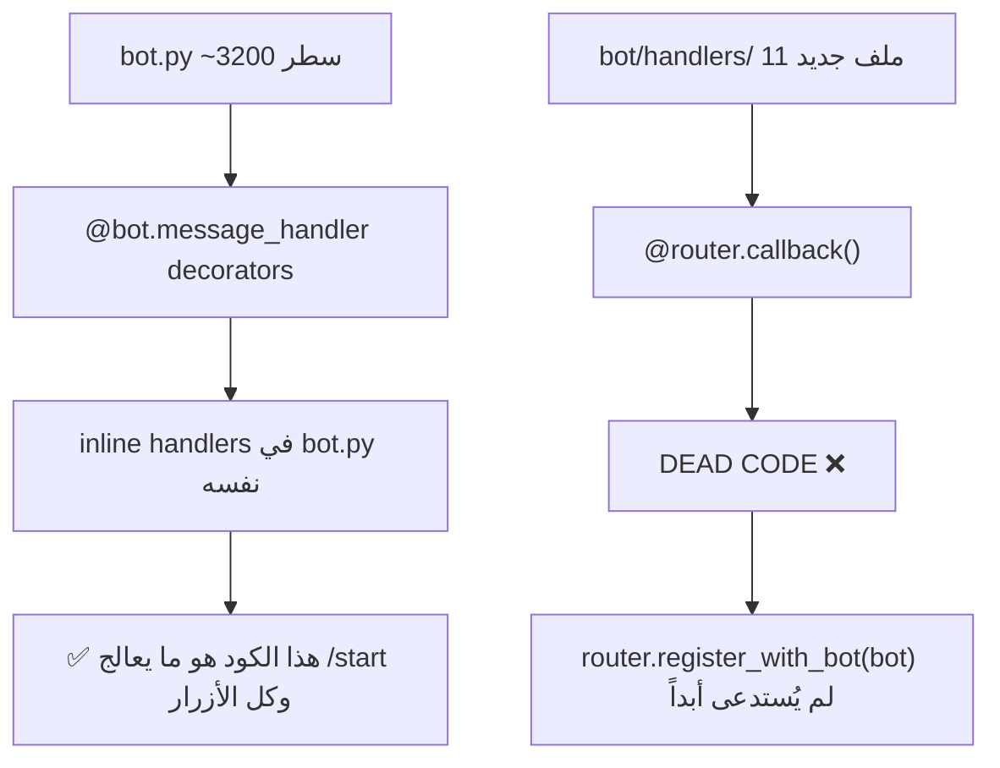

# 🏗️ خطة الهجرة النهائية إلى Enterprise Architecture

## التشخيص الجذري

### لماذا البوت يعمل "بالنظام القديم"؟

**السبب:** `bot.py` يحتوي على **~1200 سطر من الهاندلرات المضمنة** التي تعمل فعلياً (عبر `@bot.message_handler` و `@bot.callback_query_handler`). هذه الهاندلرات تستخدم الكيبورد القديم (`inline_main_keyboard`) ولا تتضمن زر اللغة، ولا تسجل المستخدمين في قاعدة البيانات، وتستخدم `sqlite3.connect()` في بعض الأماكن.

مجلد `bot/handlers/` الجديد (11 ملف) هو **كود ميت** — لم يتم توصيله بالبوت.

---

## الخطة: 5 مراحل

### المرحلة 1: تفعيل Router + bot/handlers/ الجديدة

**الحالة الحالية:**
- `bot.py` يحتوي على 3200 سطر
- ~1200 سطر منها هاندلرات مكررة في `bot/handlers/`

**الإجراء:**
1. حذف الهاندلرات المكررة من `bot.py` (~1200 سطر) واستبدالها بـ 15 سطر تسجيل
2. تسجيل جميع وحدات `bot/handlers/` عبر `router.register_with_bot(bot)`

**الهاندلرات المراد حذفها من bot.py:**

| السطور | الوظيفة | البديل في bot/handlers/ |
|--------|---------|------------------------|
| admin_panel, admin_stats | إحصائيات الأدمن | `admin/stats.py` |
| set_profit, process_profit_percentage | ضبط نسبة الربح | `admin/settings.py` |
| set_usd_rate, process_usd_rate | ضبط سعر الصرف | `admin/settings.py` |
| transactions, pagination | عرض المعاملات | `admin/transactions.py` |
| broadcast, process_broadcast | رسالة جماعية | `admin/broadcast.py` |
| users_list, process_user_search | إدارة المستخدمين | `admin/users.py` |
| manage_channels, add/remove_channel | إدارة القنوات | `admin/channels.py` |
| operator_settings, change_operator | إعدادات المشغلين | `admin/operators.py` |
| check_membership | فحص العضوية | `membership.py` |

**الهاندلرات المتبقية في bot.py (أساسية):**
- `/start` + `/language` + `setlang_*` + `back_to_main`
- `buy_number`, `check_balance`, `help`, `my_orders`
- `webhook` (استقبال تحديثات تيليجرام)
- `/verify/` (ZarinPal callback)

### المرحلة 2: إصلاح i18n + الكيبورد + تسجيل المستخدم

1. إضافة `UserRepository().create_if_not_exists(user_id, 'fa')` في `/start`
2. إضافة زر `🌐 اللغة` في الكيبورد
3. الكيبورد يستخدم `main_menu_keyboard` من `bot/keyboards/main_keyboard.py`

### المرحلة 3: تنظيف sqlite3.connect() المتبقية (~11 مكالمة)

استبدال كل `sqlite3.connect()` المتبقية بـ ConnectionManager أو repositories.

### المرحلة 4: حذف compat/legacy_facade

استبدال مباشر بـ WalletService + SMSService + OrderService + PaymentService.

### المرحلة 5: تنظيف البيانات القديمة

- `users_backup.json = {}` (تم ✅)
- حذف db files عند كل نشر

---

## الإحصاءات

| المقياس | القيمة |
|---------|--------|
| أسطر للحذف من bot.py | ~1200 |
| أسطر للإضافة | ~15 |
| ملفات bot/handlers/ المفعلة | 11 |
| sqlite3.connect() المتبقية | ~11 |
| تكلفة كلية | المراحل 1-3 أساسية، 4-5 اختيارية |

---

## مطلوب الموافقة

هل أوافق على هذه الخطة للتنفيذ؟