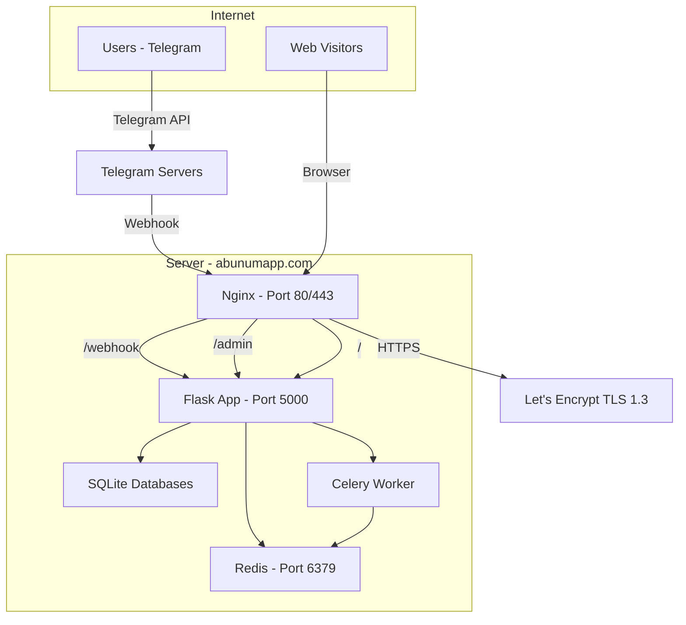

# 🏗️ Master Migration & Production Deployment Plan

> **Project:** 5simTelegramBot → Enterprise SaaS Platform on abunumapp.com
> **Scope:** Complete legacy-to-new migration + Production deployment
> **Date:** 2026-05-27
> **Status:** ⏳ AWAITING APPROVAL — DO NOT EXECUTE
> **Mandate:** Zero downtime, zero data loss, fully reversible, incremental

---

## 📊 1. COMPREHENSIVE LEGACY SYSTEM ANALYSIS

### 1.1 Legacy Monolith: [`bot.py`](bot.py:1) — 4,006 Lines

| Category | Count | Details |
|----------|-------|---------|
| Telegram `@bot.callback_query_handler` | 40+ | All inline in one file |
| Telegram `@bot.message_handler` | 5 | start, admin, language, all_messages (empty) |
| Flask `@app.route` | 20+ | webhook, payment verify, orders, price_calc, test_*, check_database, backup_* |
| Standalone business functions | 15+ | get_prices, get_products, buy_activation_number, refund_order_amount, save_order, create_required_tables (×3!), initialize_bot (×2!) |
| `register_next_step_handler` chains | 12+ | Multi-step conversations for admin flows |
| Raw `sqlite3.connect()` calls | 100+ | Direct SQL everywhere — no connection pooling |

### 1.2 All Legacy Telegram Handlers — Complete Inventory

| # | Handler / Callback Pattern | Lines | Function | Risk Level |
|---|---------------------------|-------|----------|------------|
| 1 | `/start` | 261-277 | `start_handler` | 🟢 LOW |
| 2 | `/language` | 280-303 | `language_handler` | 🟢 LOW |
| 3 | `setlang_` | 305-321 | `handle_language_selection` | 🟢 LOW |
| 4 | `check_membership` | 324-384 | `check_membership` | 🟡 MEDIUM |
| 5 | `buy_number, check_balance, help, help_*` | 390-477 | `handle_main_menu` | 🟢 LOW |
| 6 | `back_to_main` | 479-486 | `back_to_main_menu` | 🟢 LOW |
| 7 | `service_` | 488-525 | `handle_service_selection` | 🟡 MEDIUM |
| 8 | `country_` | 686-834 | `handle_country_selection` | 🔴 HIGH — price calc + API |
| 9 | `back_to_services` | 836-843 | `back_to_services` | 🟢 LOW |
| 10 | `/admin` | 855-878 | `admin_panel` | 🟡 MEDIUM |
| 11 | `admin_stats` | 880-987 | `handle_admin_stats` | 🟡 MEDIUM |
| 12 | `update_rate` | 989-1001 | `update_currency_rate` | 🟡 MEDIUM |
| 13 | `admin_panel` (callback) | 1003-1029 | `handle_admin_panel_button` | 🟡 MEDIUM |
| 14 | `set_card, new_card, check_card_info` | 1031-1050 | Card management | 🟡 MEDIUM |
| 15 | `manage_users` | 1052-1079 | `handle_manage_users` | 🟡 MEDIUM |
| 16 | `users_list, users_prev_page, users_next_page` | 1081-1125 | User listing | 🟡 MEDIUM |
| 17 | `search_user` | 1127-1185 | User search flow | 🟡 MEDIUM |
| 18 | `modify_balance_*` | 1187-1206 | Admin balance modify init | 🔴 HIGH — balance mutation |
| 19 | `add_balance_*, reduce_balance_*` | 1208-1283 | Admin balance change exec | 🔴 HIGH — balance mutation |
| 20 | `broadcast_message` | 1285-1340 | `handle_broadcast` | 🟡 MEDIUM |
| 21 | `set_profit` | 1343-1410 | Profit percentage management | 🟡 MEDIUM |
| 22 | `set_usd_rate` | 1413-1455 | USD rate management | 🟡 MEDIUM |
| 23 | `transactions, transactions_prev, transactions_next` | 1458-1581 | Transaction listing | 🟢 LOW |
| 24 | `manage_channels, add_channel, remove_channel, del_channel_*` | 1609-1799 | Channel management | 🟢 LOW |
| 25 | `check_channels_status` | 1801-1849 | Channel status check | 🟢 LOW |
| 26 | `toggle_lock` | 1851-1865 | Lock toggle | 🟢 LOW |
| 27 | `no_operator` | 1867-1869 / 3998-4000 | No operator handler (×2!) | 🟢 LOW |
| 28 | `buy_number_` | 2124-2322 | `handle_buy_number` (comprehensive) | 🔴 CRITICAL — purchase + balance + API |
| 29 | `get_code_` | 2324-2400 | `handle_get_code` | 🔴 HIGH — SMS check + DB update |
| 30 | `cancel_order_` | 2469-2536 | `handle_cancel_order` | 🔴 CRITICAL — refund + API cancel |
| 31 | `operator_settings` | 2573-2609 | `handle_operator_settings` | 🟡 MEDIUM |
| 32 | `change_operator` | 2611-2638 | `handle_change_operator` | 🟡 MEDIUM |
| 33 | `select_service_` | 2640-2671 | `handle_select_service` | 🟡 MEDIUM |
| 34 | `select_country_` | 2673-2708 | `handle_select_country` + process_operator_change | 🟡 MEDIUM |
| 35 | `my_orders` | 2711-2735 | `handle_my_orders` | 🟢 LOW |
| 36 | `add_funds` | 2798-2813 | `handle_add_funds` | 🔴 HIGH — payment gateway entry |
| 37 | `zarinpal_payment` | 2815-2823 | `handle_zarinpal_payment` | 🔴 CRITICAL — payment initiation |
| 38 | `card_payment` | 2986-2994 | `handle_card_payment` | 🔴 HIGH — card payment entry |
| 39 | `copy_*` | 2996-2999 | `handle_copy` | 🟢 LOW |
| 40 | `send_receipt_*` | 3001-3009 | `handle_send_receipt` | 🟡 MEDIUM |
| 41 | `approve_payment_*, reject_payment_*` | 3011-3014 | `handle_payment_verification` | 🔴 CRITICAL — balance mutation |

### 1.3 All Legacy Flask Routes — Complete Inventory

| # | Route | Lines | Function | Risk Level |
|---|-------|-------|----------|------------|
| 1 | `/` (GET/POST) | 200-213 | `webhook` | 🔴 CRITICAL — Telegram webhook |
| 2 | `/orders/<user_id>` | 2737-2796 | `user_orders` | 🟡 MEDIUM |
| 3 | `/verify/<user_id>/<amount>` | 2883-2982 | `verify_payment` | 🔴 CRITICAL — payment callback |
| 4 | `/test_db_connection` | 3163-3173 | `test_db_connection` (guarded) | 🟢 LOW |
| 5 | `/test_create_user` (POST) | 3175-3193 | `test_create_user` (guarded) | 🟡 MEDIUM |
| 6 | `/test_add_balance` (POST) | 3195-3212 | `test_add_balance` (guarded) | 🔴 HIGH |
| 7 | `/test_transaction` (POST) | 3214-3271 | `test_transaction` (guarded) | 🔴 HIGH |
| 8 | `/test_check_balance` (POST) | 3273-3286 | `test_check_balance` (guarded) | 🟡 MEDIUM |
| 9 | `/test_payment` | 3288-3291 | `test_payment_page` (guarded) | 🟢 LOW |
| 10 | `/recreate_transactions_table` | 3293-3312 | `recreate_transactions_table` (guarded) | 🔴 HIGH — destructive |
| 11 | `/test_backup` | 3317-3320 | `test_backup_page` (guarded) | 🟢 LOW |
| 12 | `/create_backup` | 3322-3339 | `create_backup` (guarded) | 🟢 LOW |
| 13 | `/restore_backup` | 3341-3358 | `restore_backup` (guarded) | 🔴 HIGH — destructive |
| 14 | `/backup_content` | 3360-3379 | `backup_content` (guarded) | 🟡 MEDIUM |
| 15 | `/backup_status` | 3381-3388 | `backup_status` (guarded) | 🟢 LOW |
| 16 | `/check_database` | 3408-3441 | `check_database` (guarded) | 🟡 MEDIUM |
| 17 | `/test_purchase` | 3443-3446 | `test_purchase_page` (guarded) | 🟢 LOW |
| 18 | `/test_get_services` | 3448-3472 | `test_get_services` (guarded) | 🟢 LOW |
| 19 | `/test_get_countries/<service>` | 3474-3498 | `test_get_countries` (guarded) | 🟢 LOW |
| 20 | `/test_get_number` (POST) | 3500-3536 | `test_get_number` (guarded) | 🟡 MEDIUM |
| 21 | `/test_purchase_number` (POST) | 3538-3592 | `test_purchase_number` (guarded) | 🔴 HIGH — real purchase |
| 22 | `/price_calculator` | 3709-3730 | `price_calculator` (guarded) | 🟢 LOW |
| 23 | `/update_usd_rate` | 3732-3767 | `update_usd_rate` (guarded) | 🟡 MEDIUM |
| 24 | `/get_usd_rate` | 3769-3796 | `get_usd_rate` (guarded) | 🟢 LOW |
| 25 | `/get_settings` | 3798-3825 | `get_settings` (guarded) | 🟢 LOW |
| 26 | `/telegram_prices` | 3827-3830 | `telegram_prices` (guarded) | 🟢 LOW |
| 27 | `/api/get_telegram_price/<country>` | 3832-3919 | `get_telegram_price` (guarded) | 🟡 MEDIUM |
| 28 | `/test_api_key` | 3921-3946 | `test_api_key` (guarded) | 🟢 LOW |

### 1.4 Critical Issues Found in Legacy System

#### 🔴 CRITICAL

| ID | Issue | Location | Impact |
|----|-------|----------|--------|
| C1 | **Multiple `create_required_tables()` definitions (×3)** | [`bot.py:529`](bot.py:529), [`bot.py:3595`](bot.py:3595), [`bot.py:2542`](bot.py:2542) | Schema inconsistency across restarts |
| C2 | **Multiple `initialize_bot()` definitions (×2)** | [`bot.py:2542`](bot.py:2542), [`bot.py:3390`](bot.py:3390) | Conflicting initialization |
| C3 | **Duplicate `handle_no_operator` (×2)** | [`bot.py:1867`](bot.py:1867), [`bot.py:3998`](bot.py:3998) | Second definition shadows first |
| C4 | **Orders table — 3+ different schemas** | users.db vs bot.db vs orders.db | Data fragmentation, silent errors |
| C5 | **Settings duplicated across admin.db + bot.db** | usd_rate, profit_percentage in both | Config drift — different queries read different DBs |
| C6 | **`refund_order_amount()` queries `activation_id` column** | [`bot.py:2412`](bot.py:2412) | Column may not exist in all `orders` table variants |
| C7 | **`get_wallet_info()` overwrites `users.balance` with `total_deposit` only** | [`wallet.py:148`](wallet.py:148) | Loses purchase deductions — balance corruption |
| C8 | **ZarinPal callback: amount passed in URL** | [`bot.py:2838`](bot.py:2838) | Attacker can manipulate amount |
| C9 | **`/recreate_transactions_table` recreates with `CREATE TABLE` not `CREATE TABLE IF NOT EXISTS`** | [`database.py:34`](database.py:34) — `DROP TABLE` removed but `CREATE TABLE` may fail |
| C10 | **No transaction atomicity between balance change and transaction log** | [`database.py:126-167`](database.py:126) | Race condition: balance updated, log not written |

#### 🟡 HIGH

| ID | Issue | Location |
|----|-------|----------|
| H1 | `wallet.py` references `wallet` table that is never created | [`wallet.py:54`](wallet.py:54) |
| H2 | `reduce_balance()` operates on `wallet` table, `deduct_balance()` on `users` table | [`wallet.py:98-120`](wallet.py:98) vs [`wallet.py:183-211`](wallet.py:183) |
| H3 | `save_order()` in bot.py connects to `bot.db`; `setup_database()` creates `orders` in `users.db` | [`bot.py:3647`](bot.py:3647) vs [`bot.py:72`](bot.py:72) |
| H4 | `handle_get_code()` connects to `bot.db` for order update but `save_order()` also writes to `bot.db` | [`bot.py:2368`](bot.py:2368) |
| H5 | `Buy_activation_number` called without operator info sometimes | [`bot.py:2213`](bot.py:2213) |
| H6 | User search `process_user_search` uses `users.db` hardcoded string | [`bot.py:1155`](bot.py:1155) |

### 1.5 Dangerous Operations — MUST be Transaction-Safe

| Operation | Current State | Risk |
|-----------|---------------|------|
| `add_balance()` + `save_transaction()` | NOT atomic — two separate connections | Balance written, log lost |
| Purchase: balance deduction + order save + transaction log | 3 separate connections to 2 different DBs | Partial state |
| Cancel: API cancel + refund + order status update | Sequential, no rollback | API cancels but refund fails |
| Card payment approval: balance add + payment status update | Sequenced in code, not DB-level atomic | Balance credited but payment stays pending |
| Backup restore: JSON→SQLite via INSERT OR REPLACE | Overwrites current data | No pre-restore backup |

---

## 📊 2. NEW ENTERPRISE ARCHITECTURE — CURRENT STATE ASSESSMENT

### 2.1 What Exists (Already Built)

| Layer | Component | Status | Ready? |
|-------|-----------|--------|--------|
| **Services** | `OrderService` with state machine | ✅ Built | Ready for wiring |
| **Services** | `WalletService` (single source of truth) | ✅ Built | Ready for wiring |
| **Services** | `PaymentService` (ZarinPal + Card-to-Card gateways) | ✅ Built | Ready for wiring |
| **Services** | `SMSService` (HeroSMS provider with retry) | ✅ Built | Ready for wiring |
| **Services** | `UserService` | ✅ Built | Ready for wiring |
| **Services** | `AdminService` with audit logging | ✅ Built | Ready for wiring |
| **Services** | `SettingsService` | ✅ Built | Ready for wiring |
| **Services** | `CacheService` (Redis-backed) | ✅ Built | Ready for wiring |
| **Services** | `NotificationService` | ✅ Built | Ready for wiring |
| **Services** | `ReferralService` | ✅ Built | Ready for wiring |
| **Services** | `SubscriptionService` | ✅ Built | Ready for wiring |
| **Services** | `AnalyticsService` | ✅ Built | Ready for wiring |
| **Services** | `ApiKeyService` | ✅ Built | Ready for wiring |
| **Services** | `AuditService` | ✅ Built | Ready for wiring |
| **Services** | `EventBus` | ✅ Built | Ready for wiring |
| **Services** | `FeatureFlags` | ✅ Built | Ready for wiring |
| **Services** | `RBACService` | ✅ Built | Ready for wiring |
| **Repositories** | `UserRepository` | ✅ Built | Ready |
| **Repositories** | `OrderRepository` | ✅ Built | Ready |
| **Repositories** | `TransactionRepository` | ✅ Built | Ready |
| **Repositories** | `SettingsRepository` | ✅ Built | Ready |
| **Repositories** | `CardPaymentRepository` | ✅ Built | Ready |
| **DB Layer** | `ConnectionManager` (pooling) | ✅ Built | Ready |
| **DB Layer** | `MigrationManager` | ✅ Built | Ready |
| **DB Layer** | `SchemaManager` | ✅ Built | Ready |
| **DTOs/Enums** | `OrderDTO`, `OrderStatus`, `PaymentResultDTO`, etc. | ✅ Built | Ready |
| **Bot** | `Router` system | ✅ Built | Needs handler modules |
| **Bot** | `ErrorHandler` + `Middleware` | ✅ Built | Ready |
| **Bot Handlers** | `start.py`, `language.py`, `services.py`, `help.py` | ✅ 4 built | 37+ remaining |
| **Web** | `HealthCheck` endpoints | ✅ Built | Ready |
| **Admin** | `admin/routes.py` (REST API) | ✅ Built | Ready |
| **Monitoring** | `MetricsRegistry` | ✅ Built | Ready |
| **Infrastructure** | `Dockerfile` (multi-stage) | ✅ Built | Ready |
| **Infrastructure** | `docker-compose.yml` | ✅ Built | Ready |
| **Infrastructure** | `nginx.conf` | ✅ Built | Needs SSL |
| **Infrastructure** | `docker-entrypoint.sh` | ✅ Built | Ready |

### 2.2 What is MISSING — Gap Analysis

| # | Gap | Current Location in Legacy | Priority |
|---|-----|---------------------------|----------|
| 1 | **Purchase handler wiring** — `OrderService` not used by real purchase flow | [`bot.py:2124-2322`](bot.py:2124) | 🔴 P0 |
| 2 | **Balance display** — `WalletService` not used by `check_balance` handler | [`bot.py:395-411`](bot.py:395) | 🔴 P0 |
| 3 | **SMS check handler** — `SMSService.check_sms()` not wired | [`bot.py:2324-2400`](bot.py:2324) | 🔴 P0 |
| 4 | **Cancel handler** — `OrderService` + `SMSService` not used for cancel | [`bot.py:2469-2536`](bot.py:2469) | 🔴 P0 |
| 5 | **Payment handlers** — `PaymentService` not wired | [`bot.py:2798-2982`](bot.py:2798) | 🔴 P0 |
| 6 | **Card payment handlers** — `PaymentService.card_to_card` not wired | [`bot.py:2986-3014`](bot.py:2986) | 🔴 P0 |
| 7 | **Country selection + pricing** — `SMSService.get_price_info()` not wired | [`bot.py:686-834`](bot.py:686) | 🔴 P0 |
| 8 | **Admin stats** — `AdminService.get_stats()` not wired | [`bot.py:880-987`](bot.py:880) | 🟡 P1 |
| 9 | **Admin balance modification** — `AdminService.add_balance()` not wired | [`bot.py:1187-1283`](bot.py:1187) | 🔴 P0 |
| 10 | **Admin settings** — `AdminService.set_*()` not wired | [`bot.py:1343-1455`](bot.py:1343) | 🟡 P1 |
| 11 | **Admin channels** — `AdminService` channel methods not wired | [`bot.py:1609-1865`](bot.py:1609) | 🟡 P1 |
| 12 | **Admin operators** — `AdminService` operator methods not wired | [`bot.py:2573-2708`](bot.py:2573) | 🟡 P1 |
| 13 | **Admin broadcast** — No `broadcast_user_ids()` via service | [`bot.py:1285-1340`](bot.py:1285) | 🟢 P2 |
| 14 | **Admin transactions view** — `AdminService.get_recent_transactions()` not wired | [`bot.py:1458-1581`](bot.py:1458) | 🟢 P2 |
| 15 | **Order web view** — `OrderRepository` not used in `/orders/` route | [`bot.py:2737-2796`](bot.py:2737) | 🟢 P2 |
| 16 | **Webhook handler** — Still in legacy bot.py, not modular | [`bot.py:200-213`](bot.py:200) | 🟡 P1 |
| 17 | **Flask app factory** — `create_app()` not in use; app defined in bot.py | [`bot.py:40`](bot.py:40) | 🟡 P1 |
| 18 | **Bot client factory** — TeleBot instance created in bot.py, not via `bot/client.py` | [`bot.py:39`](bot.py:39) | 🟡 P1 |
| 19 | **Many Telegram handler modules missing** | 37+ handlers still in bot.py | 🔴 P0 |
| 20 | **Main entry point** — Still `python bot.py`, not using new `main.py` pattern | [`bot.py:3949`](bot.py:3949) | 🟡 P1 |

---

## 🗺️ 3. COMPLETE MIGRATION MAP — Legacy → New

```
LEGACY (bot.py)                              →  NEW ENTERPRISE LAYER
━━━━━━━━━━━━━━━━━━━━━━━━━━━━━━━━━━━━━━━━━━━━━━━━━━━━━━━━━━━━━━━━━━━━━━━━━━━━━━━

📁 Legacy Module/Function                    →  📁 New Location

── Handlers ──────────────────────────────────────────────────────────────────
bot.py: start_handler()                      →  bot/handlers/start.py (✅ exists, needs wiring)
bot.py: language_handler()                   →  bot/handlers/language.py (✅ exists, needs wiring)
bot.py: handle_language_selection()          →  bot/handlers/language.py
bot.py: check_membership()                   →  bot/handlers/membership.py (NEW)
bot.py: handle_main_menu()                   →  bot/handlers/menu.py (NEW)
bot.py: back_to_main_menu()                  →  bot/handlers/menu.py (NEW)
bot.py: handle_service_selection()           →  bot/handlers/services.py (✅ exists, needs wiring)
bot.py: handle_country_selection()           →  bot/handlers/purchase.py (NEW)
bot.py: back_to_services()                   →  bot/handlers/purchase.py (NEW)
bot.py: handle_buy_number()                  →  bot/handlers/purchase.py (NEW)
bot.py: handle_get_code()                    →  bot/handlers/orders.py (NEW)
bot.py: handle_cancel_order()               →  bot/handlers/orders.py (NEW)
bot.py: handle_my_orders()                   →  bot/handlers/orders.py (NEW)
bot.py: handle_add_funds()                   →  bot/handlers/payment.py (NEW)
bot.py: handle_zarinpal_payment()            →  bot/handlers/payment.py (NEW)
bot.py: handle_card_payment()                →  bot/handlers/payment.py (NEW)
bot.py: handle_copy()                        →  bot/handlers/payment.py (NEW)
bot.py: handle_send_receipt()                →  bot/handlers/payment.py (NEW)
bot.py: handle_payment_verification()        →  bot/handlers/payment.py (NEW)
bot.py: admin_panel()                        →  bot/handlers/admin/dashboard.py (NEW)
bot.py: handle_admin_panel_button()          →  bot/handlers/admin/dashboard.py (NEW)
bot.py: handle_admin_stats()                 →  bot/handlers/admin/stats.py (NEW)
bot.py: update_currency_rate()               →  bot/handlers/admin/settings.py (NEW)
bot.py: handle_set_profit()                  →  bot/handlers/admin/settings.py (NEW)
bot.py: handle_set_usd_rate()                →  bot/handlers/admin/settings.py (NEW)
bot.py: handle_manage_users()                →  bot/handlers/admin/users.py (NEW)
bot.py: handle_users_list()                  →  bot/handlers/admin/users.py (NEW)
bot.py: handle_search_user()                 →  bot/handlers/admin/users.py (NEW)
bot.py: handle_modify_balance()             →  bot/handlers/admin/users.py (NEW)
bot.py: handle_balance_amount()              →  bot/handlers/admin/users.py (NEW)
bot.py: handle_broadcast()                   →  bot/handlers/admin/broadcast.py (NEW)
bot.py: handle_transactions()                →  bot/handlers/admin/transactions.py (NEW)
bot.py: handle_transactions_pagination()     →  bot/handlers/admin/transactions.py (NEW)
bot.py: handle_manage_channels()             →  bot/handlers/admin/channels.py (NEW)
bot.py: handle_add_channel()                 →  bot/handlers/admin/channels.py (NEW)
bot.py: handle_remove_channel()              →  bot/handlers/admin/channels.py (NEW)
bot.py: handle_delete_channel()              →  bot/handlers/admin/channels.py (NEW)
bot.py: handle_check_channels_status()       →  bot/handlers/admin/channels.py (NEW)
bot.py: handle_toggle_lock()                 →  bot/handlers/admin/channels.py (NEW)
bot.py: handle_set_card()                    →  bot/handlers/admin/settings.py (NEW)
bot.py: handle_new_card()                    →  bot/handlers/admin/settings.py (NEW)
bot.py: check_card_info()                    →  bot/handlers/admin/settings.py (NEW)
bot.py: handle_operator_settings()           →  bot/handlers/admin/operators.py (NEW)
bot.py: handle_change_operator()             →  bot/handlers/admin/operators.py (NEW)
bot.py: handle_select_service()              →  bot/handlers/admin/operators.py (NEW)
bot.py: handle_select_country()              →  bot/handlers/admin/operators.py (NEW)
bot.py: handle_no_operator()                 →  bot/handlers/purchase.py (NEW)
bot.py: handle_all_messages() (empty)        →  DELETE

── Business Logic ────────────────────────────────────────────────────────────
bot.py: get_available_services()             →  services/sms_service.py (✅ SMSService exists)
bot.py: get_countries_for_service()          →  data/service_countries.py (✅ already exists)
bot.py: get_prices()                         →  services/sms_service.py (✅ SMSService.get_price_info())
bot.py: get_products()                        →  services/sms_service.py (✅ SMSService.get_numbers_status())
bot.py: buy_activation_number()              →  services/sms_service.py (✅ SMSService.buy_number())
bot.py: get_price_for_operator()             →  services/sms_service.py
bot.py: get_current_usd_rate()               →  services/settings_service.py (✅ exists)
bot.py: refund_order_amount()                →  services/order_service.py (✅ OrderService.refund())
bot.py: save_order()                         →  db/repositories/order_repository.py (✅ exists)
bot.py: save_user()                          →  services/user_service.py (✅ UserService.get_or_create())

── Database Operations ──────────────────────────────────────────────────────
bot.py: setup_database()                     →  db/schema.py (✅ SchemaManager exists)
bot.py: setup_admin_database()               →  db/schema.py
bot.py: create_required_tables() (×3)        →  DELETE — use db/schema.py
bot.py: ensure_settings_table_exists()       →  DELETE — use db/schema.py
bot.py: initialize_bot() (×2)                →  DELETE — use main entrypoint
database.py: setup_users_database()          →  db/schema.py
database.py: setup_admin_database()          →  db/schema.py
database.py: setup_orders_database()         →  db/schema.py
database.py: get_user_balance()              →  db/repositories/user_repository.py (✅ exists)
database.py: add_balance()                   →  db/repositories/user_repository.py (✅ exists)
database.py: save_transaction()              →  db/repositories/transaction_repository.py (✅ exists)
database.py: get_card_info()                 →  db/repositories/settings_repository.py (✅ exists)
wallet.py: Wallet class (entire)             →  services/wallet_service.py (✅ exists)
payment.py: ZarinPal class                   →  services/payment_service.py (✅ ZarinPalGateway exists)
card_payment.py: CardPayment class           →  services/payment_service.py (✅ CardToCardGateway exists)

── Flask Routes ─────────────────────────────────────────────────────────────
bot.py: webhook()                            →  web/routes/webhook.py (NEW)
bot.py: user_orders()                        →  web/routes/orders.py (NEW)
bot.py: verify_payment()                     →  web/routes/payment.py (NEW)
bot.py: test_* endpoints                     →  web/routes/admin_api.py (NEW — consolidate)
bot.py: /price_calculator                    →  web/routes/admin_api.py
bot.py: /telegram_prices                     →  web/routes/admin_api.py
bot.py: /api/get_telegram_price/<country>    →  web/routes/admin_api.py
bot.py: /test_api_key                        →  web/routes/admin_api.py
bot.py: /check_database                      →  web/routes/admin_api.py
bot.py: backup_* routes                      →  web/routes/admin_api.py
routes/order_details.py                      →  KEEP — already modularized as Blueprint

── Helper/Keyboard Functions ─────────────────────────────────────────────────
bot.py: inline_main_keyboard()               →  bot/keyboards/main_keyboard.py (✅ exists)
bot.py: services_keyboard()                  →  bot/keyboards/main_keyboard.py (✅ exists)

── Process Functions (register_next_step_handler chains) ─────────────────────
bot.py: process_user_search()                →  bot/handlers/admin/users.py
bot.py: process_balance_change()             →  bot/handlers/admin/users.py
bot.py: process_broadcast()                  →  bot/handlers/admin/broadcast.py
bot.py: process_profit_percentage()          →  bot/handlers/admin/settings.py
bot.py: process_usd_rate()                   →  bot/handlers/admin/settings.py
bot.py: process_channel_username()           →  bot/handlers/admin/channels.py
bot.py: process_operator_change()            →  bot/handlers/admin/operators.py
bot.py: process_zarinpal_amount()            →  bot/handlers/payment.py
bot.py: process_card_number()                →  bot/handlers/admin/settings.py
bot.py: process_card_holder()                →  bot/handlers/admin/settings.py
```

---

## 🔌 4. COMPATIBILITY/ADAPTER LAYER DESIGN

### 4.1 Strategy: Feature Flags to Gate New vs Legacy Code

```python
# services/feature_flags.py (already exists — add migration gates)
from services.feature_flags import FeatureFlags

# Flag: use_new_order_service (default: False during migration, True after verified)
# Flag: use_new_wallet_service (default: False during migration, True after verified)
# Flag: use_new_payment_service (default: False during migration, True after verified)
# Flag: use_new_sms_service (default: False during migration, True after verified)
# Flag: use_new_admin_service (default: False during migration, True after verified)
```

### 4.2 Dual-Write Adapter Pattern (for balance mutations)

During migration, balance mutations go through BOTH old and new paths:

```python
# During Phase A migration:
def add_balance_with_dual_write(user_id, amount):
    old_balance = legacy_add_balance(user_id, amount)     # ← existing code
    new_balance = wallet_service.deposit(user_id, amount)  # ← new service
    assert old_balance == new_balance, "MIGRATION ERROR: balance mismatch!"
    return new_balance
```

### 4.3 Legacy Facade

```python
# compat/legacy_facade.py — TEMPORARY file, deleted after Phase G
class LegacyFacade:
    """Routes calls to either legacy or new code based on feature flags."""
    
    def add_balance(self, user_id, amount):
        if FeatureFlags.is_enabled('use_new_wallet_service'):
            return wallet_service.deposit(user_id, amount)
        return legacy_add_balance(user_id, amount)
```

---

## 📋 5. PHASED MIGRATION PLAN — INCREMENTAL & REVERSIBLE

```
┌────────────────────────────────────────────────────────────────────────┐
│ MIGRATION PHASES OVERVIEW                                              │
│                                                                        │
│ A: Wallet Migration      ████████░░░░░░░░░░   [Week 1]   Low Risk     │
│ B: SMS Service Migration ████████████░░░░░░   [Week 1-2] Medium Risk  │
│ C: Order Service Wiring  ████████████████░░   [Week 2]   HIGH Risk    │
│ D: Payment Migration     ██████████████████   [Week 2-3] CRITICAL     │
│ E: Telegram Handlers     ██████████████████   [Week 3-4] Medium Risk  │
│ F: Web Routes + Admin    ██████████████████   [Week 4]   Medium Risk  │
│ G: Legacy Shutdown       ██████████████████   [Week 4-5] CRITICAL     │
│ H: Production Deployment ██████████████████   [Week 5]   CRITICAL     │
└────────────────────────────────────────────────────────────────────────┘
```

---

### 📦 Phase A: Wallet Migration

**Goal:** All balance operations go through `WalletService` instead of direct SQL.

**Duration:** ~3 days
**Risk Level:** 🟡 MEDIUM
**Rollback Strategy:** Disable `use_new_wallet_service` feature flag

#### Step A.1: Verify WalletService ↔ Legacy Parity
| Action | File | Details |
|--------|------|---------|
| Run balance comparison for all users | test script | Compare `WalletService.get_balance()` vs `database.get_user_balance()` for every user |
| Run deposit stress test | test script | 100 concurrent deposits, verify both systems match |
| Run withdraw stress test | test script | 100 concurrent withdrawals, verify both systems match |

**Tests Required:**
- Unit: `test_wallet_balance_consistency` — 100 users, random deposits/withdrawals
- Integration: `test_wallet_concurrent_operations` — 10 threads, 50 ops each
- Regression: `test_legacy_wallet_still_works` — existing flows unchanged

#### Step A.2: Add Dual-Write to All Balance Operations in bot.py
| File | Lines | Change |
|------|-------|--------|
| [`bot.py:395-411`](bot.py:395) | `handle_main_menu` check_balance | Read via `WalletService.get_balance()` |
| [`bot.py:1225-1283`](bot.py:1225) | `process_balance_change` | Write via `WalletService.deposit()` + `wallet_service.admin_add_balance()` |
| [`bot.py:1951`](bot.py:1951) | `handle_buy_number` balance deduction | Write via `WalletService.withdraw()` |
| [`bot.py:2225`](bot.py:2225) | `handle_buy_number` (comprehensive) balance deduction | Write via `WalletService.withdraw()` |
| [`bot.py:2402-2467`](bot.py:2402) | `refund_order_amount` | Write via `WalletService.deposit()` |
| [`bot.py:2883-2982`](bot.py:2883) | `verify_payment` ZarinPal | Write via `WalletService.deposit()` |
| [`card_payment.py:186`](card_payment.py:186) | `verify_payment` card-to-card | Write via `WalletService.deposit()` |

**Rollback:** Remove dual-write import → revert to legacy-only

#### Step A.3: Enable `use_new_wallet_service` Feature Flag
- Set flag to `True` — all balance reads now from `WalletService`
- Monitor for 24 hours
- If zero discrepancies → proceed to Phase B

---

### 📦 Phase B: SMS Service Migration

**Goal:** All hero-sms.com API calls go through `SMSService` + `HeroSMSProvider`.

**Duration:** ~4 days
**Risk Level:** 🟡 MEDIUM
**Rollback Strategy:** Disable `use_new_sms_service` feature flag

#### Step B.1: Verify SMS Provider Parity
| Action | File | Details |
|--------|------|---------|
| Compare `SMSService.get_prices()` vs `bot.get_prices()` | test script | Same country+service, compare results |
| Compare `SMSService.buy_number()` vs `bot.buy_activation_number()` | test script | Dry-run with `max_price=0` |
| Compare `SMSService.check_sms()` vs `bot.handle_get_code()` logic | test script | Verify response parsing matches |
| Compare `SMSService.cancel_number()` vs legacy cancel | test script | Dry-run cancel |

**Tests Required:**
- Unit: `test_herosms_provider_all_actions` — mock API, verify all 6 actions
- Integration: `test_sms_service_price_calculation` — real API, verify profit math
- Regression: `test_legacy_price_calculation_unchanged`

#### Step B.2: Wire SMSService into Legacy Handlers
| File | Lines | Change |
|------|-------|--------|
| [`bot.py:155-173`](bot.py:155) | `get_prices()` | Use `SMSService.get_price_info()` |
| [`bot.py:176-197`](bot.py:176) | `get_products()` | Use `SMSService.get_numbers_status()` |
| [`bot.py:686-834`](bot.py:686) | `handle_country_selection` | Use `SMSService.get_price_info()` for pricing |
| [`bot.py:2024-2122`](bot.py:2024) | `buy_activation_number()` | Use `SMSService.buy_number()` |
| [`bot.py:2124-2322`](bot.py:2124) | `handle_buy_number` | Use `SMSService.get_price_info()` + `SMSService.buy_number()` |
| [`bot.py:2324-2400`](bot.py:2324) | `handle_get_code` | Use `SMSService.check_sms()` |
| [`bot.py:2469-2536`](bot.py:2469) | `handle_cancel_order` | Use `SMSService.cancel_number()` |

#### Step B.3: Enable `use_new_sms_service` Feature Flag
- Set flag to `True`
- Monitor for 24 hours
- If zero API errors → proceed to Phase C

---

### 📦 Phase C: Order Service Wiring (HIGH RISK)

**Goal:** All order operations go through `OrderService` with strict state machine.

**Duration:** ~5 days
**Risk Level:** 🔴 HIGH
**Rollback Strategy:** Disable `use_new_order_service` feature flag

#### Step C.1: Verify Order State Machine
| Action | Details |
|--------|---------|
| Test all valid state transitions | CREATED→PAID→PROCESSING→WAITING_SMS→COMPLETED |
| Test all cancel paths | Any active state→CANCELLED→REFUNDED |
| Test invalid transitions rejected | COMPLETED→CANCELLED should raise ValueError |
| Test concurrent transition rejection | Two simultaneous cancels — only one should succeed |

**Tests Required:**
- Unit: [`test_order_state_machine.py`](tests/test_order_state_machine.py) already exists — expand
- Integration: `test_order_create_to_complete_flow`
- Stress: `test_concurrent_order_cancellation` — 10 threads, 1 order

#### Step C.2: Wire OrderService into Purchase Flow
| File | Change |
|------|--------|
| [`bot.py:2124-2322`](bot.py:2124) | `handle_buy_number` → `OrderService.create_order()` + `OrderService.confirm_purchase()` |
| [`bot.py:1954-2014`](bot.py:1954) | Old `handle_buy_number` → Replace inline SQL with `OrderService` |
| [`bot.py:2324-2400`](bot.py:2324) | `handle_get_code` → `OrderService.receive_sms()` |
| [`bot.py:2469-2536`](bot.py:2469) | `handle_cancel_order` → `OrderService.cancel_order()` + `OrderService.refund_order()` |

#### Step C.3: Enable `use_new_order_service` Feature Flag
- Set flag to `True`
- **CRITICAL:** Monitor order creation, status transitions, and refunds for 48 hours
- Zero discrepancies → proceed to Phase D

---

### 📦 Phase D: Payment Migration (CRITICAL)

**Goal:** All payment operations go through `PaymentService` gateways.

**Duration:** ~5 days
**Risk Level:** 🔴 CRITICAL
**Rollback Strategy:** Disable `use_new_payment_service` feature flag

#### Step D.1: Verify Payment Gateways
| Action | Details |
|--------|---------|
| ZarinPal sandbox test | `ZarinPalGateway.create_payment()` + `verify_payment()` in sandbox |
| Card-to-Card approval test | `CardToCardGateway` create → approve → verify balance |
| Card-to-Card rejection test | Create → reject → verify no balance change |
| Duplicate payment test | Submit same payment twice → verify idempotency |

**Tests Required:**
- Unit: `test_zarinpal_gateway_mocked` — mock ZarinPal API
- Integration: `test_card_to_card_full_flow` — real DB, real services
- Regression: `test_legacy_payment_still_works`

#### Step D.2: Wire PaymentService into Handlers
| File | Change |
|------|--------|
| [`bot.py:2798-2813`](bot.py:2798) | `handle_add_funds` → use `PaymentService` to choose gateway |
| [`bot.py:2815-2881`](bot.py:2815) | `handle_zarinpal_payment` + `process_zarinpal_amount` → use `ZarinPalGateway` |
| [`bot.py:2883-2982`](bot.py:2883) | `verify_payment` Flask route → use `PaymentService.process_callback()` |
| [`bot.py:2986-3014`](bot.py:2986) | Card payment handlers → use `CardToCardGateway` |

#### Step D.3: Critical Safety Checks Before Enabling
1. **DUPLICATE PAYMENT PREVENTION:** Add payment request idempotency key to `ZarinPalGateway`
2. **AMOUNT VERIFICATION:** Server-side amount compare — never trust URL amount
3. **ADMIN APPROVAL ATOMICITY:** `CardToCardGateway.approve()` must be all-or-nothing (balance + status)
4. Set `use_new_payment_service` → `True`, monitor for 72 hours

---

### 📦 Phase E: Telegram Handlers Migration

**Goal:** All handlers moved from bot.py to modular `bot/handlers/` modules, registered via `Router`.

**Duration:** ~7 days
**Risk Level:** 🟡 MEDIUM
**Rollback Strategy:** Router can switch back to legacy handlers

#### Step E.1: Create Handler Modules (in order)

| # | New File | Handlers Included |
|---|----------|-------------------|
| 1 | `bot/handlers/menu.py` | `handle_main_menu`, `back_to_main_menu` |
| 2 | `bot/handlers/membership.py` | `check_membership` |
| 3 | `bot/handlers/purchase.py` | `handle_service_selection`, `handle_country_selection`, `back_to_services`, `handle_buy_number`, `handle_no_operator` |
| 4 | `bot/handlers/orders.py` | `handle_get_code`, `handle_cancel_order`, `handle_my_orders` |
| 5 | `bot/handlers/payment.py` | `handle_add_funds`, `handle_zarinpal_payment`, `handle_card_payment`, `handle_copy`, `handle_send_receipt`, `handle_payment_verification`, `process_zarinpal_amount` |
| 6 | `bot/handlers/admin/__init__.py` | Admin package init |
| 7 | `bot/handlers/admin/dashboard.py` | `admin_panel`, `handle_admin_panel_button` |
| 8 | `bot/handlers/admin/stats.py` | `handle_admin_stats`, `update_currency_rate` |
| 9 | `bot/handlers/admin/settings.py` | `handle_set_profit`, `process_profit_percentage`, `handle_set_usd_rate`, `process_usd_rate`, `handle_set_card`, `handle_new_card`, `check_card_info`, `process_card_number`, `process_card_holder` |
| 10 | `bot/handlers/admin/users.py` | `handle_manage_users`, `handle_users_list`, `handle_search_user`, `process_user_search`, `handle_modify_balance`, `handle_balance_amount`, `process_balance_change` |
| 11 | `bot/handlers/admin/broadcast.py` | `handle_broadcast`, `process_broadcast` |
| 12 | `bot/handlers/admin/transactions.py` | `handle_transactions`, `handle_transactions_pagination` |
| 13 | `bot/handlers/admin/channels.py` | `handle_manage_channels`, `handle_add_channel`, `process_channel_username`, `handle_remove_channel`, `handle_delete_channel`, `handle_check_channels_status`, `handle_toggle_lock` |
| 14 | `bot/handlers/admin/operators.py` | `handle_operator_settings`, `handle_change_operator`, `handle_select_service`, `handle_select_country`, `process_operator_change` |

#### Step E.2: Handler Migration Process (per module)
1. Extract handler functions to new module
2. Add `@router.callback('pattern')` or `@router.command('cmd')` decorator
3. Replace direct `bot.*` calls with injected bot instance
4. Replace direct `sqlite3.connect()` with repository/service calls
5. Test handler in isolation
6. Register module in `bot/__init__.py`
7. Comment out handler in bot.py (DON'T DELETE yet)

---

### 📦 Phase F: Web Routes + Admin API Migration

**Goal:** All Flask routes moved out of bot.py into `web/routes/`.

**Duration:** ~4 days
**Risk Level:** 🟡 MEDIUM

#### Step F.1: Create Web Route Modules

| # | New File | Routes Included |
|---|----------|-----------------|
| 1 | `web/routes/webhook.py` | `/` webhook |
| 2 | `web/routes/orders.py` | `/orders/<user_id>` |
| 3 | `web/routes/payment.py` | `/verify/<user_id>/<amount>` |
| 4 | `web/routes/admin_api.py` | All `/test_*`, `/check_database`, `/backup_*`, `/price_calculator`, `/telegram_prices`, `/api/*` |
| 5 | `web/app.py` | Flask app factory `create_app()` |

#### Step F.2: Switch to Flask App Factory Pattern
```python
# web/app.py (already partially exists)
def create_app():
    app = Flask(__name__)
    app.register_blueprint(health_bp)
    app.register_blueprint(webhook_bp)
    app.register_blueprint(orders_bp)
    app.register_blueprint(payment_bp)
    app.register_blueprint(admin_api_bp)
    app.register_blueprint(order_details_bp)  # existing
    return app
```

---

### 📦 Phase G: Legacy Shutdown (CRITICAL)

**Goal:** Stop all writes through legacy code, make new system the single source of truth.

**Duration:** ~5 days
**Risk Level:** 🔴 CRITICAL

#### Step G.1: Verification Checklist (BEFORE any deletion)
- [ ] All 41 legacy handlers have new equivalents and are in production
- [ ] All 28 legacy Flask routes have new equivalents
- [ ] Zero direct `sqlite3.connect()` in any handler module
- [ ] Zero `add_balance()` called outside `WalletService`
- [ ] Zero `save_transaction()` called outside `TransactionRepository`
- [ ] All payment verifications go through `PaymentService`
- [ ] All SMS API calls go through `SMSService`
- [ ] All order operations go through `OrderService` state machine
- [ ] Feature flags show 100% traffic through new services for 7 consecutive days
- [ ] Zero balance discrepancies in 7-day audit

#### Step G.2: Graceful Degradation
1. **Day 1:** Set all feature flags to `True` (new code only), keep bot.py as pass-through
2. **Day 2-7:** bot.py becomes a thin router — each handler delegates to new module
3. **Day 8:** Remove handler bodies from bot.py (keep function stubs for reference)
4. **Day 9:** Remove business logic from bot.py (keep only imports + router)
5. **Day 10:** bot.py reduced to ~100 lines — imports modules, creates app, runs

#### Step G.3: Legacy File Deletion Schedule
| File | When to Delete | Precondition |
|------|---------------|--------------|
| `wallet.py` | After Phase A complete + 7 days stability | Zero imports from wallet.py |
| `payment.py` | After Phase D complete + 7 days stability | ZarinPalGateway verified |
| `card_payment.py` | After Phase D complete + 7 days stability | CardToCardGateway verified |
| `database.py` | After Phase G step 2 complete | Zero imports from database.py |
| `bot_utils.py` | After Phase E complete | Handlers use new middleware |
| `admin_config.py` | After Phase F complete | AdminService handles all |
| `operator_config.py` | After Phase E complete | AdminService handles operators |
| `bot.py` | After Phase H deployment verified | Entire system runs on new architecture |

---

### 📦 Phase H: Production Deployment on abunumapp.com

**Goal:** Full production deployment with Docker, Nginx, Redis, HTTPS.

**Duration:** ~5 days
**Risk Level:** 🔴 CRITICAL

#### Step H.1: Pre-Deployment Checklist
- [ ] All phases A–G completed and verified
- [ ] All tests passing (unit, integration, regression, smoke)
- [ ] Docker image builds cleanly
- [ ] docker-compose up validates all services
- [ ] SSL certificates provisioned (Let's Encrypt)
- [ ] Domain DNS configured: `sms.abunumapp.com` → server IP
- [ ] Firewall rules configured (ports 80, 443 only)
- [ ] Environment variables set in `.env` (NOT in code)
- [ ] Database backed up

#### Step H.2: Deployment Architecture



#### Step H.3: Deployment Steps

```bash
# 1. Clone repository on server
git clone <repo-url> /opt/smsbot
cd /opt/smsbot

# 2. Configure environment
cp .env.example .env
nano .env  # Fill in ALL values

# 3. Set up SSL certificates
mkdir -p certs data/backups logs nginx/conf.d
certbot certonly --standalone -d sms.abunumapp.com
ln -s /etc/letsencrypt/live/sms.abunumapp.com/fullchain.pem certs/
ln -s /etc/letsencrypt/live/sms.abunumapp.com/privkey.pem certs/

# 4. Uncomment HTTPS section in nginx/nginx.conf

# 5. Build and start
docker compose build --no-cache
docker compose up -d

# 6. Verify deployment
curl http://localhost:5000/ping              # → pong
curl https://sms.abunumapp.com/ping         # → pong
curl https://sms.abunumapp.com/health        # → health JSON

# 7. Set Telegram webhook
curl -X POST "https://api.telegram.org/bot<TOKEN>/setWebhook?url=https://sms.abunumapp.com/"

# 8. Monitor logs
docker compose logs -f bot
```

#### Step H.4: Zero-Downtime Deployment Strategy

```bash
# Blue-Green Deployment:
# 1. Build new image
docker compose build bot

# 2. Start new container alongside old
docker compose up -d --scale bot=2

# 3. Health check new instance
curl http://localhost:5001/ping

# 4. Update Nginx to point to new instance
# (Modify upstream block, reload nginx)

# 5. Stop old instance
docker compose stop bot_old
docker compose rm bot_old
```

#### Step H.5: Rollback Deployment

```bash
# 1. Revert to previous image
docker compose down
git checkout <previous-stable-tag>
docker compose build bot
docker compose up -d

# 2. Restore database from backup
python -c "from backup_manager import BackupManager; BackupManager().restore_backup()"
```

#### Step H.6: Monitoring Setup

| Component | Tool | Check |
|-----------|------|-------|
| Application health | `/health` endpoint | Every 30s |
| Liveness | `/ping` endpoint | Every 10s |
| Database | `ConnectionManager.get_stats()` | Every 60s |
| Redis | `redis-cli PING` | Every 30s |
| SMS Provider | `SMSService.get_balance()` | Every 60s |
| Payment Gateway | Sandbox test payment | Every 1 hour |
| SSL | Certificate expiry | Daily |
| Disk space | `df -h` | Every 5 min |
| Memory | `free -m` | Every 5 min |

#### Step H.7: Firewall/Security Hardening

```bash
# Allow only necessary ports
ufw default deny incoming
ufw default allow outgoing
ufw allow 80/tcp
ufw allow 443/tcp
ufw allow 22/tcp    # SSH
ufw enable

# Fail2ban for SSH
apt install fail2ban
systemctl enable fail2ban
```

---

## 🧪 6. TESTING STRATEGY

### 6.1 Test Pyramid

```
         ┌──────────┐
         │   E2E    │  5%  — Full purchase flow, payment flow
         ├──────────┤
         │Integration│ 15%  — Service + Repository + API
         ├──────────┤
         │   Unit   │  80% — Pure business logic, state machine, DTOs
         └──────────┘
```

### 6.2 Testing Per Phase

| Phase | Unit Tests | Integration Tests | Regression Tests | Smoke Tests |
|-------|-----------|-------------------|-----------------|-------------|
| A — Wallet | `test_wallet_balance_consistency`, `test_wallet_concurrent_operations` | `test_wallet_vs_legacy_parity` | `test_legacy_wallet_still_works` | `/ping`, balance check on 5 users |
| B — SMS | `test_herosms_provider_actions`, `test_sms_service_price_calc` | `test_sms_service_vs_legacy` | `test_legacy_price_calculation` | Price check on 3 services × 3 countries |
| C — Orders | `test_order_state_machine_all_transitions`, `test_order_invalid_transitions` | `test_order_full_lifecycle` | `test_legacy_order_creation` | Create → Cancel → Refund flow |
| D — Payments | `test_zarinpal_gateway`, `test_card_to_card_gateway` | `test_payment_full_flow` | `test_legacy_payment_callback` | Sandbox payment complete flow |
| E — Handlers | Per-module handler tests with mocked bot | `test_router_registration` | `test_all_callback_patterns_match` | `/start`, `/language`, buy flow |
| F — Web | `test_webhook_route`, `test_payment_callback_route` | `test_flask_app_factory` | `test_all_routes_resolve` | All web routes return 200 |
| G — Shutdown | `test_new_system_coverage` | `test_no_legacy_imports` | `test_zero_direct_sql` | Full flow test |
| H — Deploy | `test_docker_build`, `test_docker_compose_up` | `test_nginx_proxy`, `test_redis_connect` | `test_webhook_setup` | All health checks pass |

### 6.3 Production Verification Checklist (per phase)

- [ ] Balance operations: 5 users × (deposit → verify → withdraw → verify)
- [ ] Purchase flow: Select service → country → buy → get code → cancel → refund
- [ ] Payment flow: ZarinPal sandbox + card-to-card approval + rejection
- [ ] Admin flow: Stats → users → settings → broadcast
- [ ] Language flow: Switch fa↔en↔ar → verify all keyboards
- [ ] Channel flow: Join check → admin add/remove channel
- [ ] Backup flow: Create backup → modify balance → restore → verify

### 6.4 Load Testing

```bash
# Using locust or similar:
# 100 concurrent users
# 5-minute ramp-up
# 15-minute sustained
# Target: < 2s p95 response time for purchase flow
# Target: < 500ms p95 for balance check
# Target: Zero database-locked errors
```

---

## 📏 7. SUCCESS CRITERIA

### 7.1 Mandatory (Must Be Met Before Phase G)

| # | Criterion | Verification Method |
|---|-----------|---------------------|
| SC1 | 100% feature parity — every legacy handler has new equivalent | Handler registry count match |
| SC2 | Zero balance discrepancies between legacy and new system | Daily audit script for 7 days |
| SC3 | Zero direct SQL in handler modules | `grep -r "sqlite3.connect" bot/handlers/` returns empty |
| SC4 | All business logic inside services | Manual code review of each handler |
| SC5 | All balance mutations go through `WalletService` | `grep -r "add_balance\|UPDATE.*balance" bot/handlers/` returns empty |
| SC6 | All order state transitions validated by state machine | `OrderService` used for all CRUD operations |
| SC7 | All API calls go through providers | `SMSService` used for all hero-sms calls |
| SC8 | Payment verification is idempotent | Duplicate callback test passes |
| SC9 | Zero hardcoded Persian strings in handlers | `grep -r "[\\u0600-\\u06FF]" bot/handlers/` only in locale files |
| SC10 | All sensitive config in `.env` | `grep -r "token\|api_key\|merchant" config.py` returns env reads only |

### 7.2 Production Deployment Success Criteria

| # | Criterion | Verification |
|---|-----------|-------------|
| PD1 | `https://sms.abunumapp.com/ping` returns `pong` | curl test |
| PD2 | `https://sms.abunumapp.com/health` returns all green | curl test |
| PD3 | Telegram webhook receives updates | Send /start to bot |
| PD4 | SSL certificate valid (TLS 1.3) | SSL Labs test |
| PD5 | Redis connected and caching | Health check shows cache hits |
| PD6 | Nginx rate limiting active | 31 rapid requests → 429 response |
| PD7 | Celery worker processing tasks | Check worker logs |
| PD8 | Backup running on schedule | Check backup dir for recent files |
| PD9 | All admin test endpoints protected | 403 without admin token |
| PD10 | Zero `database is locked` errors in 24h | Monitor logs |

---

## 🗑️ 8. LEGACY REMOVAL PLAN

### 8.1 Deletion Order (safest first)

```
1. wallet.py            → Delete after Phase A + 7 days
2. payment.py           → Delete after Phase D + 7 days
3. card_payment.py      → Delete after Phase D + 7 days
4. bot_utils.py         → Delete after Phase E + 3 days
5. admin_config.py      → Delete after Phase F + 3 days
6. operator_config.py   → Delete after Phase F + 3 days
7. currency_service.py  → Delete after Phase B + 7 days (SMSService handles)
8. backup_manager.py    → Delete after Phase F + 7 days (Celery task handles)
9. database.py          → Delete after Phase G + 7 days
10. bot.py              → Delete after Phase H + 14 days of production stability
```

### 8.2 Pre-Deletion Verification Per File

```bash
# Before deleting any legacy file:
grep -r "from wallet import" --include="*.py" .    # Must return empty
grep -r "import wallet" --include="*.py" .         # Must return empty
grep -r "wallet\." --include="*.py" .              # Must return empty
```

### 8.3 Final Cleanup

After all legacy files deleted:
```bash
# Remove unused imports from __init__.py files
# Clean up requirements.txt (remove unused deps)
# Remove legacy data files (users_backup.json if DB-backed)
# Remove test endpoints (move to admin panel)
# Run full test suite one final time
# Tag release: git tag v2.0.0-enterprise
```

---

## 🚀 9. PRODUCTION DEPLOYMENT — COMPLETE RUNBOOK

### 9.1 Server Requirements

| Resource | Minimum | Recommended |
|----------|---------|-------------|
| CPU | 2 cores | 4 cores |
| RAM | 2 GB | 4 GB |
| Disk | 20 GB SSD | 50 GB SSD |
| OS | Ubuntu 22.04 LTS | Ubuntu 22.04 LTS |
| Docker | 24+ | 26+ |
| Docker Compose | v2 | v2 |

### 9.2 Software Stack

| Component | Version | Purpose |
|-----------|---------|---------|
| Python | 3.11 | Application runtime |
| Flask | 3.x | Web framework |
| Gunicorn | 21.x | WSGI server (future) |
| Redis | 7-alpine | Cache + Queue |
| Nginx | 1.25-alpine | Reverse proxy |
| SQLite | 3 | Database (embedded) |
| Certbot | latest | SSL certificates |

### 9.3 Environment Variables (.env)

```bash
# Telegram
BOT_TOKEN=your_bot_token_here
ADMIN_IDS=1457637832,another_admin_id

# Web
WEBHOOK_URL=https://sms.abunumapp.com
WEBSITE_URL=https://sms.abunumapp.com

# HeroSMS
HEROSMS_API_KEY=your_api_key
HEROSMS_API_URL=https://hero-sms.com/stubs/handler_api.php

# Payment — ZarinPal
ZARINPAL_MERCHANT=your_merchant_id
ZARINPAL_SANDBOX=false

# Currency
NAVASAN_API_KEY=your_api_key

# Database
USERS_DB=users.db
ADMIN_DB=admin.db

# Redis
REDIS_URL=redis://redis:6379/0

# Feature Flags
USE_NEW_WALLET_SERVICE=true
USE_NEW_SMS_SERVICE=true
USE_NEW_ORDER_SERVICE=true
USE_NEW_PAYMENT_SERVICE=true
USE_NEW_ADMIN_SERVICE=true
```

### 9.4 Deployment Commands (Copy-Paste Ready)

```bash
# === COMPLETE DEPLOYMENT SEQUENCE ===

# 1. Server setup
sudo apt update && sudo apt upgrade -y
sudo apt install -y docker.io docker-compose-v2 nginx certbot python3-certbot-nginx curl ufw

# 2. Firewall
sudo ufw allow 22/tcp
sudo ufw allow 80/tcp
sudo ufw allow 443/tcp
sudo ufw --force enable

# 3. Clone & configure
cd /opt
git clone <your-repo-url> smsbot
cd smsbot
cp .env.example .env
nano .env  # Fill ALL values

# 4. SSL (initial — HTTP only first)
sudo certbot certonly --standalone -d sms.abunumapp.com
sudo mkdir -p certs
sudo ln -s /etc/letsencrypt/live/sms.abunumapp.com/fullchain.pem certs/
sudo ln -s /etc/letsencrypt/live/sms.abunumapp.com/privkey.pem certs/

# 5. Uncomment HTTPS section in nginx/nginx.conf

# 6. Build & start
sudo docker compose build --no-cache
sudo docker compose up -d

# 7. Verify
sleep 10
curl http://localhost:5000/ping
curl https://sms.abunumapp.com/ping
curl https://sms.abunumapp.com/health

# 8. Set webhook
curl "https://api.telegram.org/bot${BOT_TOKEN}/setWebhook?url=https://sms.abunumapp.com/"

# 9. Monitor
sudo docker compose logs -f --tail=50

# 10. SSL auto-renewal cron
echo "0 3 * * * certbot renew --quiet && docker compose restart nginx" | sudo crontab -
```

### 9.5 Backup Automation

```bash
# crontab entry:
# Database backup every hour
0 * * * * cd /opt/smsbot && docker compose exec -T bot python -c "from backup_manager import BackupManager; BackupManager().create_backup()"

# Daily offsite backup (to remote server or S3)
0 2 * * * cd /opt/smsbot && tar czf /tmp/smsbot_backup_$(date +\%Y\%m\%d).tar.gz data/ *.db && scp /tmp/smsbot_backup_*.tar.gz user@backup-server:/backups/
```

### 9.6 Health Check Alerting

```bash
# cron entry — every 5 minutes:
*/5 * * * * curl -sf https://sms.abunumapp.com/ping || echo "SMS Bot DOWN at $(date)" | mail -s "ALERT: SMS Bot" admin@abunumapp.com
```

---

## 📊 10. RISK MATRIX — MIGRATION

| Risk | Phase | Probability | Impact | Mitigation |
|------|-------|-------------|--------|------------|
| Balance discrepancy during dual-write | A | Medium | HIGH | Continuous audit script, auto-revert flag |
| SMS API response format change | B | Low | HIGH | Response parser with fallback, provider swap capability |
| Order state machine rejects valid transition | C | Medium | HIGH | Extensive state machine unit tests before wiring |
| Payment double-spend | D | Low | CRITICAL | Idempotency keys, DB-level uniqueness constraints |
| Handler callback pattern conflict | E | Medium | MEDIUM | Router tests, pattern uniqueness validation |
| Webhook downtime during switch | F | Low | HIGH | Blue-green deployment, Telegram retry mechanism |
| Premature deletion of legacy code | G | Medium | CRITICAL | Feature flags + 7-day safety window per file |
| SSL expiry | H | Low | MEDIUM | Auto-renewal cron, monitoring |
| Database corruption | H | Low | CRITICAL | Hourly backups, offsite copies, restore tested monthly |
| Redis failure | H | Medium | LOW | Cache miss → direct DB, Redis AOF persistence |

---

## 📊 11. TIMELINE SUMMARY

```
Week 1: Phase A (Wallet) + Phase B (SMS Service)
Week 2: Phase C (Orders) + Phase D begin (Payments)
Week 3: Phase D complete (Payments) + Phase E begin (Handlers)
Week 4: Phase E complete (Handlers) + Phase F (Web Routes)
Week 5: Phase G (Legacy Shutdown) + Phase H (Deployment)
Week 6+: Production monitoring + Legacy file deletion schedule
```

---

> ⚠️ **IMPORTANT — READ BEFORE PROCEEDING:**
>
> This document is the COMPLETE migration and deployment plan.
> **NO code has been modified. NO files have been deleted.**
> All analysis, mapping, and planning is complete.
>
> **Next Step:** Your review and approval of each phase before execution begins.
>
> The plan is designed to be executed ONE PHASE AT A TIME, with explicit approval
> checkpoints between phases. Each phase is independently reversible.
>
> **Please review and indicate:**
> 1. Any concerns with the migration map (Section 3)
> 2. Any concerns with the phased approach (Section 5)
> 3. Any concerns with the deployment plan (Section 9)
> 4. Approval to begin Phase A (Wallet Migration)

---

*End of Master Migration & Deployment Plan — 2026-05-27*